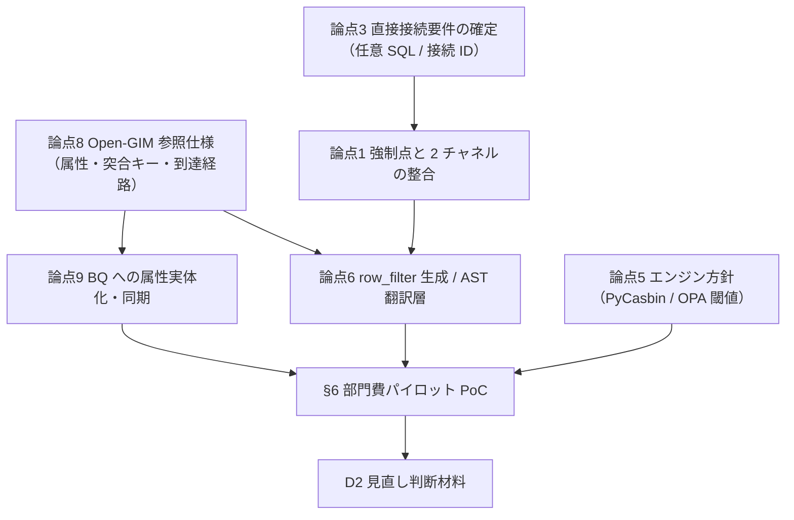

# 認可設計 未決論点と対応パターン

この文書は、`03-authorization/` に散在していた論点・検討メモを一本化した、**未決事項の正本**である。各論点について「問い → 対応パターン（メリット・デメリット）→ 推奨（落としどころ）→ 実施内容」をまとめる。

- 用語・略語は [`glossary.md`](glossary.md) を参照（認可ドキュメント共通の正本）。
- すでに決まったこと（確定事項）は §1 にサマリし、実体は各正本へリンクする。本書は決定の蒸し返しではなく、**まだ決めていないこと**に集中する。
- 「推奨（落としどころ）」は本書の提案であり、**確定事項とは区別**する。採用するには各正本（D2・platform-architecture-decision など）での決定が要る。
- 旧 `authz-patterns-P1-P5.md` と `authz-policy-brain-ronten-sheet.md` は本書へ統合した（§5 パターンカタログ・§7 出典に吸収）。

---

## 1. 前提となる確定事項（蒸し返さない）

未決論点はこの土台の上に乗る。詳細は各正本を参照。

| # | 確定事項 | 正本 |
|---|---|---|
| 1 | 基盤アーキテクチャ = **案A**（ARO 上の FastAPI コンテナ＋APIM 組込みキャッシュ＋プロセス内 LRU＋BigQuery ビュー。2026-06 に App Service から ARO へ切替） | [`../02-architecture/platform-architecture-decision.md`](../02-architecture/platform-architecture-decision.md) |
| 2 | 言語・FW = **Python / FastAPI**（D1） | [`../02-architecture/runtime-framework-decision.md`](../02-architecture/runtime-framework-decision.md) |
| 3 | 認可エンジン = **PyCasbin（埋め込み PDP）で確定**（D2）。外部 PDP（Cerbos/OPA）は将来オプション。`row_filter` 生成・列マスク・BigQuery 翻訳層は自前で補完 | [`../90-research/abac-authz-library-comparison.md`](../90-research/abac-authz-library-comparison.md) |
| 4 | 認可は **API 層 ABAC**。判断を **2 段に分ける**（①粗い gate：allow/deny、deny は 403 で短絡 → ②行フィルタ・列マスク生成）。`authorize()` は `row_filter`(AST) と `masked_columns` を返す | [`authorization-boundaries-and-interface.md`](authorization-boundaries-and-interface.md) |
| 5 | 認可属性の正本 = **Open-GIM**（社内ユーザーリポジトリ）。認証は Entra ID、認可属性は Open-GIM の二段構え | [`authorization-strategy.md`](authorization-strategy.md) |
| 6 | API 経路は **単一 SA で BigQuery** にアクセス。per-user の行制御は BQ ネイティブ RLS の主役にしない（判断＝API 層、執行＝押し下げ WHERE） | [`row-level-filtering-layering.md`](row-level-filtering-layering.md) |
| 7 | PEP↔PDP は **AuthZEN 1.0** を意識（将来のエンジン差し替えに備える） | [`authorization-boundaries-and-interface.md`](authorization-boundaries-and-interface.md) |

> ⚠️ 旧シート（ronten-sheet）が抱えていた 2 つの内部矛盾を、本書では次のとおり解消した。
> - **エンジンの正本**：旧シートは「単一ポリシー」を狙い OPA を推していたが、**プロジェクトの正本は PyCasbin（D2）で確定**。OPA は §論点5 の「見直し閾値」付き将来選択肢として整理する。
> - **強制点の呼び方**：「データ層を正本」か「API 層を正本」かは、**2 チャネルを分ければ両立する**（§論点1）。直参照は BQ RLS/CLS、API 経路は API 層 ABAC＋押し下げ WHERE。

---

## 2. 未決論点 一覧（優先度マトリクス）

優先度は「他の設計をゲートするか」「PoC で先に潰すべきか」で付けた。

| # | 論点 | テーマ | 優先度 | 推奨の方向 |
|---|---|---|---|---|
| 1 | 強制点の権威と 2 チャネルの整合（用語統一） | A 強制点・チャネル | 高 | 2 チャネル分離。直参照＝データ層、API＝API 層 |
| 2 | BigQuery Sharing をどう使うか | A 強制点・チャネル | 中 | パイロットは Sharing で検証、少数固定なら View＋IAM も比較 |
| 3 | 利用者の BigQuery 直接接続要件の確定 | A 強制点・チャネル | **最優先** | 「任意 SQL か／接続 ID は誰か」を先に確定 |
| 4 | BI/分析クライアントの接続方式（本人 or 共有 SA） | A 強制点・チャネル | 中 | 直参照は利用者本人（WIF）。共有 SA は API 経路へ |
| 5 | ポリシー統一の対象と方式（PyCasbin 整合・OPA 将来） | B エンジン・統一 | 高 | 現行 PyCasbin。OPA は閾値超で再検討 |
| 6 | 条件 AST→BigQuery 翻訳層 / `row_filter` 生成方式 | B エンジン・統一 | **最優先** | `row_scope` キー方式から開始、AST 方式へ拡張可能に |
| 7 | action / resource / context 共通語彙 | B エンジン・統一 | 中 | `read` に集約、出力先は context |
| 8 | Open-GIM 参照仕様の確定（同一性・属性・突合キー・到達経路） | C 属性供給・同期 | **最優先** | 突合キー＝oid、属性最小セットを先に確定 |
| 9 | 属性の BigQuery 側実体化と同期方式 | C 属性供給・同期 | 高 | mapping 表＋日次バッチを第一候補 |
| 10 | 属性同期の SLO と失敗時の扱い | C 属性供給・同期 | 中 | 日次、失敗時はセキュア側に倒す |
| 11 | 属性キャッシュ TTL とレイテンシ | C 属性供給・同期 | 中 | プロセス内 LRU 短 TTL（数分〜十数分） |
| 12 | SA / AI エージェントの認可（OBO or サービス ID 固定） | D 主体 | 高 | OBO とサービス ID を明確に分離（RFC 8693） |
| 13 | ガバナンス（PAP）・ドリフト検知 | E 運用・ガバナンス | 中 | Git 正本＋approved fixtures を CI ゲート |
| 14 | 監査ログのスキーマ（適用条件の記録） | E 運用・ガバナンス | 中 | 適用 WHERE＋判定理由を必須項目化 |
| 15 | 認可判定の説明可能性 | E 運用・ガバナンス | 中 | 「見える/見えない理由」を追跡可能に |
| 16 | 行レベル複数粒度としきい値の表現 | F ルール表現 | 低 | `row_scope` の語彙拡張で対応 |
| 17 | `employee_type`（グループ会社/派遣）の扱い | F ルール表現 | 低 | 業務要件で確定、既定は社員と同等 |
| 18 | 更新系（write）ポリシー | F ルール表現 | 低（将来） | 参照系の道具立てを流用、別途整理 |

---

## 3. 論点詳細

### テーマ A：強制点・チャネル設計

#### 論点1：強制点の権威と 2 チャネルの整合（用語統一）〔高〕

**問い**：行・列制御の「権威ある強制点」をデータ層（BigQuery RLS/CLS）とする
か、API 層（ABAC＋押し下げ WHERE）とするか。直 SQL／Sharing 購読者の素通りをどう扱うか。

**対応パターン**

| 案 | 内容 | メリット | デメリット |
|---|---|---|---|
| (a) データ層を権威 | どのクライアントも BQ RLS/CLS で一律強制 | クライアント非依存・素通り無し | 単一 SA 経由の API は端末ユーザーを区別不能。動的フィルタ不可 |
| (b) API 層を権威 | API 集約・BQ は API 用 SA に施錠 | 動的・属性ベースで柔軟 | 直 SQL／Sharing は覆えない |
| (c) 2 チャネル分離（多重防御） | 直参照＝データ層 RLS/CLS、API 経路＝API 層 ABAC | 各経路の特性に合致・最後の砦も残る | 行ルールが二系統。整合をテストで担保する必要 |

**推奨（落としどころ）**：**(c)**。直参照・Sharing 購読者（自分の identity で叩く）には BQ RLS/CLS、API チャネル（単一 SA）は API 層 ABAC＋押し下げ WHERE。「どちらを正本と呼ぶか」は**チャネルごとに別**と明示して用語を固定する。`roles/bigquery.filteredDataViewer` を IAM で広域付与しない（RLS 経由のみ）。

**実施内容**：用語定義（「API 経路の認可正本＝API 層」「直参照経路の認可正本＝データ層」）を本書と layering 文書で統一。2 チャネルの判定一致は §6 PoC の approved fixtures で確認。

**関連**：[`row-level-filtering-layering.md`](row-level-filtering-layering.md)、[`authorization-boundaries-and-interface.md`](authorization-boundaries-and-interface.md)、§5 パターンカタログ。

#### 論点2：BigQuery Sharing をどう使うか〔中〕

**問い**：直参照チャネルを BigQuery Sharing（Publisher/Subscriber・linked dataset）で配るか、Authorized View 跨プロジェクト＋IAM だけで足りるか。

**対応パターン**

| 案 | 内容 | メリット | デメリット |
|---|---|---|---|
| (a) BigQuery Sharing 採用 | Listing 公開→Subscriber が自己購読、linked dataset を配信 | Publisher 側 IAM を増やさず展開。提供先が増えるほど運用が軽い | Exchange/Listing/Subscriber Project/SA のガバナンスが増える |
| (b) Authorized View＋IAM のみ | 跨プロジェクトの View に明示 authorize | 機構がシンプル | 提供先が増えると運用が重い |

両案とも前提は**ワンマートを複製しない**（テナント別テーブル複製は恒久的な保守コスト）。

**推奨（落としどころ）**：提供先が増える／Subscriber 側で購読管理したいなら **(a)**、少数固定で運用が単純なら **(b)** も比較対象。**部門費パイロットでは (a) を検証**し、linked dataset 経由でも RLS が購読者の identity／所属グループに正しく効くかを確認する（まずグループ粒度）。

**実施内容**：VC本 × ST部門費の行サブセットで Sharing 配信を試す。Sharing「使う/使わない」の運用コスト比較を PoC 項目に含める。Subscriber Project と SA の発行・最小権限・鍵レス（WIF）・IaC 化の手順を確立。

**関連**：§5 パターンカタログ（P5）、[`../02-architecture/bigquery-dataform-design-rules.md`](../02-architecture/bigquery-dataform-design-rules.md)、`../work/cache-cost-observability-sharing-policy.md`。

#### 論点3：利用者の BigQuery 直接接続要件の確定〔最優先〕

**問い**：利用者アプリが「BigQuery に DB 接続したい」と言うとき、その正体は何か。これが API 層 ABAC（①）で覆えるか、別方式（②RLS/CLS 同期）が要るかの分岐になる。

**対応パターン**（要件の正体ごと）

| 正体 | 認可の効かせ方 | 成否 |
|---|---|---|
| (A) 接続方式が DB 風なだけ | ポリシー適用済みの認可ビュー／公開データセットにだけ DB 接続させる | ①に吸収可（per-user 動的は不可、スライス単位） |
| (B) 任意 SQL をエンドユーザー ID で投げたい | ポリシーを正本に RLS/CLS を生成・同期（②） | 成立（RLS は ID 起点で効く）。整合は突合テスト |
| (C) 任意 SQL を単一 SA で投げたい | ― | **原理的に不成立**（全行が SA に見える）。(A)/(B) に戻す |

**推奨（落としどころ）**：設計を進める前に **「任意 SQL か／接続 ID はエンドユーザーか SA か」の 2 点を確定**する。確定するまで ①単独か ②併用かを決め打ちしない。現スコープ（参照系・検証用 API）では (A) を基本線に置く。

**実施内容**：利用者アプリの接続要件をヒアリングして (A)/(B)/(C) に分類。結論を本書に追記し、②が必要なら shared-pdp 文書の方式検討に引き継ぐ。

**関連**：[`shared-pdp-across-api-and-bigquery.md`](shared-pdp-across-api-and-bigquery.md)（§6 成立の前提と境界）。

#### 論点4：BI/分析クライアントの接続方式（本人 or 共有 SA）〔中〕

**問い**：BI ツールが**利用者本人**で BigQuery に接続するのか、**共有 SA**で接続するのか。`SESSION_USER()` ベースの RLS は接続主体に依存する。

**対応パターン**

| 案 | 内容 | メリット | デメリット |
|---|---|---|---|
| (a) 利用者本人接続（WIF） | Entra 利用者を Workforce Identity Federation で BQ プリンシパル化 | RLS/CLS が ID 起点で効く・鍵レス | WIF（トークン交換）の構築運用が要る |
| (b) 共有 SA 接続 | BI が共有 SA で叩く | 構成が単純 | `SESSION_USER()` が SA になり利用者単位の ABAC が効かない→API 経路が必要 |

**推奨（落としどころ）**：直参照で利用者単位の制御を効かせるなら **(a) 本人接続（WIF）**。共有 SA を使うなら利用者単位制御は **API 経路（押し下げ WHERE）に寄せる**。

**実施内容**：パイロット対象の BI 接続方式を確認し、(a)/(b) を明記。(a) なら WIF プール/プロバイダ構成を PoC に追加。

**関連**：§5 パターンカタログ（P1/P5）。

---

### テーマ B：ポリシーエンジン・統一方式

#### 論点5：ポリシー統一の対象と方式（PyCasbin 整合・OPA 将来）〔高〕

**問い**：「ポリシーを 1 つにする」とは、正本仕様（spec）の統一か、実行時 PDP の統一か、判定出力（行フィルタ＝SQL）の統一か。現行採用の PyCasbin で両チャネルを 1 脳で覆えるか。

**対応パターン**

| 案 | 内容 | メリット | デメリット |
|---|---|---|---|
| ① spec のみ統一 | 正本仕様 1 つ＋実装 2 つ＋適合テスト | 既存資産を活かせる・導入が速い | runtime は二重。乖離をテストで縛る前提 |
| ② runtime 統一 | 1 つの PDP に集約 | ポリシー更新が 1 か所 | PyCasbin は SQL WHERE を吐かない→行/列は自前。OPA なら可だが採用変更 |
| ③ decision-shape 統一 | 脳が行フィルタ（SQL/AST）を返す | API・データ両強制を 1 ポリシーから導ける | PyCasbin 単独では不可。OPA Compile（≥v1.9.0）相当が要る |

**推奨（落としどころ）**：**現行は PyCasbin（D2）＝①＋②の折衷**。エンドポイント＋アクション ABAC は PyCasbin、`row_filter`／列マスクは `Decision` を返す自前層＋AST→BigQuery 翻訳層で補完し、直参照は BQ RLS/CLS が担う。③（単一ポリシーから両強制をネイティブ生成）は**将来の OPA 路線**として、部門費パイロットで成立性を検証し D2 見直し材料を得る。

**OPA への見直し閾値（90-research の採用根拠より）**：ABAC の `eval()` matcher が概ね 10〜15 ルールを超える／matcher のテスト・保守が困難化／行レベル SQL・UCAST フィルタや列マスクの**ネイティブ生成**が必要化（OPA≥v1.9.0 Compile API）。この場合、PyCasbin をエンドポイント認可に残しつつデータフィルタ判定を OPA 併設へ段階移行する。

**実施内容**：パイロットで PyCasbin の `eval()` ルール数・保守性を実測し、閾値到達を監視。閾値を超えたら D2 を再決定（OPA 併設）。

**関連**：[`../90-research/abac-authz-library-comparison.md`](../90-research/abac-authz-library-comparison.md)（採用根拠の正本）、[`../90-research/pep-pdp-design-research-2026.md`](../90-research/pep-pdp-design-research-2026.md)、§5 パターンカタログ。

#### 論点6：条件 AST→BigQuery 翻訳層 / `row_filter` 生成方式〔最優先〕

**問い**：PyCasbin は WHERE を生成しないため、判定結果から BigQuery のパラメータ化 WHERE をどう作るか。`row_scope` キー方式と AST 方式のどちらを採るか。

**対応パターン**

| 案 | 内容 | メリット | デメリット |
|---|---|---|---|
| (a) `row_scope` キー方式 | policy にレビュー済みの安全なキー（`own_created`・`same_department_all` 等）を持たせ、アプリが WHERE に変換 | 単純・レビュー容易・PyCasbin に素直 | 表現の自由度が低い。条件が増えるとキーが増殖 |
| (b) 条件 AST 方式 | PDP が条件 AST（`Decision.row_filter`）を返し、汎用に WHERE へ翻訳 | 表現力が高い・将来 OPA/Cerbos と共通化しやすい | 翻訳層の実装コストが高い |

**推奨（落としどころ）**：**(a) から開始し、(b) へ拡張できる形に設計**。`authorize()` の戻り値 `Decision` は将来 AST を載せられる構造にしておき（`row_filter` フィールド）、初期は `row_scope` キーを内部で解決する。翻訳層は文字列連結禁止・クエリパラメータ（`@param`／`UNNEST(@array)`）・前方一致は範囲展開（`BETWEEN`）でクラスタ列のプルーニングを効かせる、を必須とする。

**実施内容**：`row_scope` 語彙の確定（§論点16 と連動）、翻訳層の自作実装、dry-run でスキャンバイト検証。両経路で使い回すなら `authz_core` 共有ライブラリ化（shared-pdp 文書）。

**関連**：[`pycasbin/row-scope-to-bigquery-implementation.md`](pycasbin/row-scope-to-bigquery-implementation.md)、[`pycasbin/policy-examples-purchase-order.md`](pycasbin/policy-examples-purchase-order.md)、[`authorization-boundaries-and-interface.md`](authorization-boundaries-and-interface.md)。

#### 論点7：action / resource / context 共通語彙〔中〕

**問い**：API 経路と抽出（バッチ）経路で action/resource の語彙がズレると、ポリシーを二重に書く羽目になる。語彙をどう統一するか。

**対応パターン**

| 案 | 内容 | メリット | デメリット |
|---|---|---|---|
| (a) 経路ごとに別語彙 | API=`read`、抽出=`export` 等 | 各経路で自然 | ポリシーが二重化・共用の意味が薄れる |
| (b) action は集約、出力先は context | `read` 1 つに統一し、JSON/ファイルは context で渡す | ポリシーが 1 本・共用が成立 | 設計時に語彙設計の合意が要る |

**推奨（落としどころ）**：**(b)**。`read` に集約し出力先は context、`resource` の標準形（`model`・`path`・`owner_department`・`sensitivity`・`tenant` 等）も先に決める。認可クライアント（共有ライブラリ）に語彙を寄せる。

**実施内容**：`subject`/`action`/`resource`/`context` の語彙定義表を確定し、PyCasbin の `request_definition` と整合させる。

**関連**：[`shared-pdp-across-api-and-bigquery.md`](shared-pdp-across-api-and-bigquery.md)（§5 設計判断ポイント）、[`pycasbin/basic-specification.md`](pycasbin/basic-specification.md)（§15 次に決めること）。

---

### テーマ C：属性供給（PIP）・同期

#### 論点8：Open-GIM 参照仕様の確定〔最優先〕

**問い**：Open-GIM の参照方式・属性項目・突合キーが未確定。認可設計（ABAC のポリシー入力）の前提になる。

**確認すべき項目**

- Open-GIM と要件定義が言う「オンプレ SQL Server（ExpressRoute 接続）」は**同一実体か別物か**。同一なら接続経路はそのまま、別物なら到達経路（プロトコル・認証・閉域到達性）を定義。
- 保持する属性項目（役職レベル区分、所属＝会社/部署/グループ、原価センタ、居住地など）の一覧。
- 各項目のキー（Entra ID の oid / UPN など**何で突合するか**）。

**対応パターン**（突合キー）

| 案 | 内容 | メリット | デメリット |
|---|---|---|---|
| (a) Entra `oid` で突合 | 不変の object id を主キーに | 改名・異動に強い | Open-GIM 側が oid を保持している必要 |
| (b) UPN / メールで突合 | メールアドレスで突合 | 人が読める・既存連携が多い | 改名・再利用でズレるリスク |

**推奨（落としどころ）**：**(a) oid を主キー**、メールは補助。属性の最小セット（`id`・`department_code`・`position_code`・`employee_type`・`country_of_residence`）を先に確定する。未設定・不明値は deny 側に倒す。

**実施内容**：Open-GIM 管理者に同一性・スキーマ・突合キー・到達経路を確認。確定したら `pycasbin/basic-specification.md` の subject 属性表と突き合わせる。

**関連**：[`authorization-strategy.md`](authorization-strategy.md)、[`../01-requirements/product-requirements.md`](../01-requirements/product-requirements.md)、[`pycasbin/basic-specification.md`](pycasbin/basic-specification.md)（§8 属性・コード定義）。

#### 論点9：属性の BigQuery 側実体化と同期方式〔高〕

**問い**：BigQuery はクエリ時にオンプレ Open-GIM を直接参照できない（見えるのは `SESSION_USER()` と IAM グループのみ。federation でも回避不可）。直参照チャネルで属性を使うには BQ 側に実体化が要る。

**対応パターン（実体化）**

| 案 | 内容 | メリット | デメリット |
|---|---|---|---|
| (a) メールキーの mapping 表 | `ref.principal_attributes(email, honbu_code, …)` を RLS subquery で参照 | 素直・属性追加が容易 | subquery RLS は課金増・プルーニング非対応・参照表に `getData` が要りプライバシー懸念 |
| (b) Cloud Identity グループ | 本部ごとにグループ、`GRANT TO ('group:…')` | 非サブクエリで data masking 併用可 | Entra→Cloud Identity のグループ・プロビジョニングが追加で要る |

**対応パターン（同期手段）**

| 方式 | 向く状況 | 鮮度 |
|---|---|---|
| バッチ（第一候補）：オンプレ抽出→GCS→BQ 定期ロード or BigLake 外部表 | 組織マスタの小・低頻度 | 日次〜時次 |
| マネージド CDC（Datastream）：将来選択肢 | 分単位の鮮度が要件化したとき | 秒〜分 |

**推奨（落としどころ）**：実体化は **(a) mapping 表**を基本（属性追加が容易）。ただし subquery RLS の制約（課金・非プルーニング・100MB・Storage Read API 非互換・data masking 併用不可・参照表のプライバシー）を踏まえ **mapping 表は小さく保つ**。プライバシーが問題なら本部ごと `GRANT TO group` の非サブクエリ形／authorized view で包む。同期は **日次バッチを第一候補**、分単位が要件化したら Datastream。

**実施内容**：`ref` データセットを統制対象として設計。subquery RLS の性能・課金・data masking 併用可否を PoC で実測。`filteredDataViewer` を広域 IAM 付与しない。

**関連**：§5 パターンカタログ（P1）、[`row-level-filtering-layering.md`](row-level-filtering-layering.md)。

#### 論点10：属性同期の SLO と失敗時の扱い〔中〕

**問い**：日次同期を前提に、職改・異動の反映窓をどこまで許すか。同期失敗時にどう倒すか。

**対応パターン（失敗時）**

| 案 | 内容 | メリット | デメリット |
|---|---|---|---|
| (a) 前日スナップショット継続 | 失敗しても前日分で稼働継続 | 可用性が高い | 古い権限で見えてしまう窓が延びる |
| (b) 参照停止 | 同期失敗時は対象 API/BQ 参照を止める | 過剰開示を防ぐ | 可用性が落ちる |
| (c) セキュア側に倒す | 不明・失効分は deny | 最小権限を維持 | 正当な利用者も一時的に締め出す可能性 |

**推奨（落としどころ）**：**(c) セキュア側に倒す**を基本に、業務影響が大きい範囲のみ (a) を許容するハイブリッド。日次同期で職改・異動の反映遅延が業務上許容されることを先に確認し、不整合窓を **SLO として明示**する。

**実施内容**：反映窓の業務許容を確認、SLO（例：人事反映は翌営業日まで）を定義、失敗時挙動を実装・テスト。

**関連**：[`../02-architecture/platform-architecture-decision.md`](../02-architecture/platform-architecture-decision.md)、`../work/cache-cost-observability-sharing-policy.md`。

#### 論点11：属性キャッシュ TTL とレイテンシ〔中〕

**問い**：毎リクエストで Open-GIM を引くとレイテンシ・負荷が増える。100〜500ms 目標と両立する TTL は。

**対応パターン**

| 案 | 内容 | メリット | デメリット |
|---|---|---|---|
| (a) 都度参照（キャッシュなし） | 毎回 Open-GIM を引く | 常に最新 | レイテンシ・負荷大 |
| (b) プロセス内 LRU 短 TTL | 数分〜十数分でキャッシュ | レイテンシ低・目標に乗りやすい | TTL 分だけ属性が古い |

**推奨（落としどころ）**：**(b) プロセス内 LRU 短 TTL**（数分〜十数分）。per-user 結果キャッシュは共有ヒット率が低いので、共有キャッシュは共通参照系（マスタ・スキーマ・公開メタ）に限定。TTL は論点10 の同期 SLO と整合させる。

**実施内容**：TTL 値を決め（同期鮮度と矛盾しない範囲）、`attributes.py` 相当に集約。レイテンシを PoC で実測。

**関連**：[`row-level-filtering-layering.md`](row-level-filtering-layering.md)（§6）、[`shared-pdp-across-api-and-bigquery.md`](shared-pdp-across-api-and-bigquery.md)（§5(3)）。

---

### テーマ D：主体（SA / AI エージェント）

#### 論点12：SA / AI エージェントの認可（OBO or サービス ID 固定）〔高〕

**問い**：「システムからのアクセスは T ユーザー（SA）」とする一方、AI エージェントが「所属部署のデータのみ」に制限される例は、人の文脈を引き継ぐ（OBO）動きで T ユーザー固定権限とは別物。これを切り分けて定義する。

**対応パターン**

| 案 | 内容 | メリット | デメリット |
|---|---|---|---|
| (a) サービス ID 固定 | SA 自身の属性で判定（システム間連携） | 単純・予測可能 | 人の文脈を引き継げない |
| (b) OBO（代理） | 人の文脈を引き継いで実行（RFC 8693 delegation） | エージェントが利用者の権限内で動ける | トークン交換（Entra OBO フロー）の実装が要る |

**推奨（落としどころ）**：**両方を明確に分離して定義**。`subject` で実行主体（act）と代理元（may_act）を区別（RFC 8693）。システム間連携は (a)、利用者の文脈を引き継ぐエージェントは (b)。SA は最小権限・鍵レス（WIF）・IaC 管理、フルアクセスが要る SA ジョブは BQ の `TRUE` filter を**例外権限**として台帳化。

**実施内容**：エージェント経由が OBO かサービス ID 固定かを要件で確定。Entra ID の OBO フロー（RFC 8693）の実装可否を確認。SA 属性管理の方針を要件定義（L7）に反映。

**関連**：[`authorization-boundaries-and-interface.md`](authorization-boundaries-and-interface.md)（§5 `authorize()`）、[`authorization-strategy.md`](authorization-strategy.md)（論点⑤）。

---

### テーマ E：運用・ガバナンス

#### 論点13：ガバナンス（PAP）・ドリフト検知〔中〕

**問い**：正本ポリシーの置き場・版管理・監査・テストをどう設計するか。2 チャネルの判定差をどう防ぐか。

**対応パターン**

| 案 | 内容 | メリット | デメリット |
|---|---|---|---|
| (a) 静的な認可テーブル | 人→可否を事前付与表で管理 | 単純 | 職改で棚卸が必要・「今のシステム」と変わらない |
| (b) ポリシー（ルール）エンジン＋Git 正本 | ルールを Git/カタログに、CODEOWNERS 管理 | 異動に自動追従・変更が git commit で監査 | ルール設計・運用の習熟が要る |

**推奨（落としどころ）**：**(b)**。ポリシーを Git/カタログの正本（policy-as-product）にし、CODEOWNERS（データオーナー＋セキュリティ）で管理。**approved fixtures（被験者×文脈→見えるべき行/列）を CI で API と BQ の両方に当て、差分が出たら落とす**（ドリフト検知）。どのパターンを採っても回帰防止に併用。

**実施内容**：正本 spec とフィクスチャを作成、CI ゲート化。policy 保存は初期 Git 管理 CSV、運用で UI/申請が要れば SQLAlchemy adapter へ。

**関連**：[`../07-testing/test-concept.md`](../07-testing/test-concept.md)、[`pycasbin/basic-specification.md`](pycasbin/basic-specification.md)（§10 adapters）。

#### 論点14：監査ログのスキーマ（適用条件の記録）〔中〕

**問い**：RLS のように「黙って絞る」挙動を API 層で自前実装するため、何を監査ログに残すか。スキーマと SLO が未定。

**対応パターン**

| 案 | 内容 | メリット | デメリット |
|---|---|---|---|
| (a) アクセス有無のみ | 誰が何を叩いたか | 軽い | なぜその結果かを後追いできない |
| (b) 適用条件込み | 判定理由＋実際に適用した WHERE／マスクを記録 | 説明可能・ガバナンスの肝 | ログ量・設計コスト |

**推奨（落としどころ）**：**(b)**。`Decision.reason` と**生成した WHERE／適用マスク**を必須項目に。BigQuery 直接経路が併存するなら BQ の Data Access ログや `INFORMATION_SCHEMA.ROW_ACCESS_POLICIES` も併用。

**実施内容**：監査ログスキーマ（主体・resource・action・判定理由・適用 WHERE・マスク・タイムスタンプ・相関 ID）と保管・SLO を定義。`audit.py` 相当に共通化。

**関連**：[`authorization-boundaries-and-interface.md`](authorization-boundaries-and-interface.md)（§7）、[`row-level-filtering-layering.md`](row-level-filtering-layering.md)（§7）。

#### 論点15：認可判定の説明可能性〔中〕

**問い**：運用で必ず出る「なぜこの行が見えないのか」「なぜこの列がマスクされるのか」に答えられるか。

**推奨（落としどころ）**：Open-GIM 属性 → mapping 表 → RLS policy → CLS policy tag のどこで許可/不許可が決まったかを**追跡可能**にする。論点14 の監査ログ（判定理由）と接続。パイロットでは代表ユーザーについて「見える理由／見えない理由」を説明できることを検証項目にする。

**実施内容**：判定トレース（どの policy・どの属性で決まったか）を `Decision.reason` に構造化して載せる。代表ユーザーで説明可能性を PoC 検証。

**関連**：論点14、§6 PoC。

---

### テーマ F：ルール表現の細目

#### 論点16：行レベル複数粒度としきい値の表現〔低〕

**問い**：行レベルを「起票者／部署／事業／全社」の複数粒度で、「主席以上」「部長以上」のしきい値をどこで定義するか。

**推奨（落としどころ）**：粒度は `row_scope` の語彙で表す（`own_created`・`same_department_all`・`same_group_all`・`all_departments` 等。所属コードの前方一致を桁数で切り替え）。役職しきい値はコードが順序比較できないため、**subject 構築時に派生フラグ**（`is_group_leader_or_above` 等）へ落とし、policy ではフラグを参照。コード一覧の保守は Open-GIM／人事マスタ側。

**実施内容**：必要な粒度・しきい値を業務要件から洗い出し、`row_scope`／派生フラグの語彙を確定（論点6 と連動）。

**関連**：[`pycasbin/policy-examples-purchase-order.md`](pycasbin/policy-examples-purchase-order.md)、[`pycasbin/basic-specification.md`](pycasbin/basic-specification.md)（§8）。

#### 論点17：`employee_type`（グループ会社/派遣）の扱い〔低〕

**問い**：請負社員（`4`）は deny で確定。グループ会社社員（`2`）・派遣社員（`3`）に別の絞り込みが要るか。

**推奨（落としどころ）**：既定は社員（`1`）と同等（許可側）。別扱いが要るかは**業務要件で確定**し、必要なら deny 行や allow 条件を追加。

**実施内容**：人事・業務側に `2`/`3` の参照範囲を確認し、policy に反映。

**関連**：[`pycasbin/policy-examples-purchase-order.md`](pycasbin/policy-examples-purchase-order.md)（§4.1）。

#### 論点18：更新系（write）ポリシー〔低・将来〕

**問い**：本スコープは参照系のみ。更新系（下書きの更新可否、確定済みの更新禁止など）のポリシーは未着手。

**推奨（落としどころ）**：更新 API の設計が固まってから別途整理。参照系の道具立て（`r.obj.status` を見る ABAC、`eft = deny`＋deny-aware な `policy_effect`、取得直前の `status` 変化を 1 件単位で再評価）はそのまま流用できる。

**実施内容**：更新 API 設計の確定後に write ポリシーを別ドキュメント化。

**関連**：[`pycasbin/single-record-final-check.md`](pycasbin/single-record-final-check.md)、[`pycasbin/policy-examples-purchase-order.md`](pycasbin/policy-examples-purchase-order.md)（§4.3）。

---

## 4. 横断する未確定の依存関係

最優先論点は互いに依存する。次の順で潰すと手戻りが少ない。

---

## 5. 対応パターンカタログ（旧 P1〜P5 / 6 パターンを統合）

論点1・4・5 で参照する「ポリシー統一の実現パターン」を一覧化する。**どのパターンでも、直 SQL／Sharing 購読者は API を素通りするため BQ の RLS/CLS が最後の砦**であり、API 側 PDP（PyCasbin/OPA）は「API 経由のみ」有効である点を常に前提にする。

| # | パターン | 一言 | 頭脳の所在 | 両チャネルを 1 脳で覆えるか | 向くケース |
|---|---|---|---|---|---|
| P1 | 収束アーキ（BQ 単一機構・本人クエリ） | Entra→WIF で本人として BQ を叩き RLS/CLS が両チャネルで効く | BigQuery | ◎（直 BQ 前提） | GCP 寄せ・参照系・BQ 完結。WIF 構築を許容できる |
| P2 | API-PDP（OPA・部分評価で WHERE pushdown） | OPA Compile が WHERE を生成し API の BQ クエリに付加 | OPA(API)＋BQ | △（API チャネル内のみ） | 複雑条件/移植性が要るが単一脳を保ちたい |
| P3 | API-PDP（PyCasbin・粗い認可＋自前 SQL） | PyCasbin は粗い認可、行/列は自前 WHERE | 分散（API＋BQ） | ○（行/列は自前で二重化しやすい） | **現行採用**。軽量・in-process・小規模 |
| P4 | 二重実装＋適合テスト | API 側と BQ RLS/CLS を別実装し、approved fixtures で差分検出 | spec1／runtime2 | ○（runtime 非統一） | 既存二系統を当面活かしつつ安全運用 |
| P5 | BQ Sharing のみ（API なし） | linked dataset を配り RLS/CLS で強制 | BigQuery | チャネル A のみ | 検証用/最小・BQ ネイティブ消費者のみ |

**各パターンの要点（メリット/デメリット/実施）**

- **P1 収束アーキ**：メリット＝強制機構が BQ の RLS/CLS 一つで二重オーサリングが起きない・鍵レス。デメリット＝表現力の天井（BQ-SQL で書けない条件は不可）・API 呼び出し毎に BQ クエリ・WIF 構築運用。実施＝WIF プール/プロバイダ、RLS（TRUE＋業務フィルタ＋`SESSION_USER()`）、CLS（taxonomy/tag/Reader）、薄い FastAPI（OIDC→STS 交換→本人クエリ）。
- **P2 OPA pushdown**：メリット＝単一 Rego から WHERE/UCAST を生成・複雑条件に強い・policy-as-code 監査。デメリット＝WHERE 付加は API チャネル内のみ・OPA の SQL 方言に BigQuery が無く適応が要る・OPA は外部データを取りに行けない（属性は input）。実施＝Rego（include/mask）、OPA をサイドカー/バンドル、生成 WHERE を BQ 方言に適応。
- **P3 PyCasbin（現行）**：メリット＝軽量・FastAPI プロセス内・追加インフラ最小・RBAC＋ABAC を 1 モデルに同居。デメリット＝SQL WHERE を吐けず行/列は自前（もう一つの真実源になりやすい）・`eval()` の複雑条件に弱い・直/Sharing は BQ RLS/CLS 必須。実施＝`model.conf`＋ポリシー（CSV/DB adapter）、`row_scope`/`mask_profile` を自前で WHERE/マスクに変換、BQ RLS/CLS を多重防御に。
- **P4 二重実装＋適合テスト**：メリット＝既存資産と BQ ネイティブの両方を活かせる・導入が速い。デメリット＝実装が二重で乖離リスク常在・正本 spec(PAP) が前提。実施＝正本 spec とフィクスチャ、API/BQ をそれぞれ実装、CI で差分ゼロをマージゲート。
- **P5 Sharing のみ**：メリット＝最短最小・Publisher 側 IAM を増やさず購読者がセルフ購読。デメリット＝プログラム/エージェント（REST）提供は不可・BQ ネイティブ利用者限定。実施＝ワンマート＋RLS/CLS、Exchange/Listing 公開、WIF＋グループで RLS。

> 本プロジェクトの現行は **P3（PyCasbin）＋直参照に BQ RLS/CLS（P5 的配信）＋ドリフト検知に P4**の組み合わせ。**P1/P2 は将来オプション**（P2 は論点5 の OPA 見直し閾値に到達した場合）。

---

## 6. 部門費パイロット PoC 検証項目

部門費（VC本 × ST部門費）で、未決論点の成立性をまとめて検証する。

- [ ] ワンマート上の Authorized View＋RLS で「ST部門費の行サブセット」を VC本 に提供できるか（複製マートなし）。〔論点2〕
- [ ] BigQuery Sharing の linked dataset 経由で RLS が購読者の identity／所属グループに正しく効くか（まずグループ粒度）。〔論点2,4〕
- [ ] `SESSION_USER()`＋Open-GIM 由来 mapping 表の subquery RLS が機能するか／課金・プルーニング影響の実測。〔論点9〕
- [ ] 列の出し分け（予算＝全員／実績＝管理職のみ）が CLS（タグ＋マスキング）で表現できるか。data masking と subquery 型 RLS の併用制約も確認。〔論点9〕
- [ ] PyCasbin の policy から API の BQ クエリ用 WHERE が想定どおり生成されるか（`row_scope`→WHERE）。〔論点6〕
- [ ] approved fixtures（被験者×文脈→見えるべき行/列）を API と BQ の両方に当て差分ゼロ。〔論点1,13〕
- [ ] Open-GIM/オンプレ属性を BQ 側 mapping 表に日次同期できるか（オンプレ抽出→GCS→BQ ロード or BigLake 外部表）。〔論点8,9〕
- [ ] 日次同期で職改・異動の反映遅延が業務上許容されるか。同期失敗時の倒し方を決定。〔論点10〕
- [ ] mapping 表のプライバシー（subquery RLS は参照表に `getData` が要り他人の本部コードが見え得る）の可否確認。〔論点9〕
- [ ] BI／分析クライアントが利用者本人で接続するか共有 SA か。〔論点4〕
- [ ] subject→属性→Decision→生成 WHERE→BigQuery 実行→列マスク の一連を最小実装。〔論点6,12〕
- [ ] 代表ユーザーで「見える理由／見えない理由」を説明できるか。〔論点15〕
- [ ] PyCasbin の `eval()` ルール数・保守性を実測し、OPA 見直し閾値への距離を把握。〔論点5〕

---

## 7. 付録：主要出典（2026 時点）

詳細な調査の生記録は `90-research/` が正本（[`abac-authz-library-comparison.md`](../90-research/abac-authz-library-comparison.md)、[`pep-pdp-design-research-2026.md`](../90-research/pep-pdp-design-research-2026.md)、[`authorization-models-and-standards-2026.md`](../90-research/authorization-models-and-standards-2026.md)）。ここでは本書の論点で load-bearing な出典のみを残す。

**BigQuery RLS / CLS / Sharing / Authorized View**
1. Google Cloud — Introduction to row-level security（grantee/filter、課金・Storage Read API 非互換・TRUE フィルタ）. https://docs.cloud.google.com/bigquery/docs/row-level-security-intro
2. Google Cloud — Use row-level security（`CREATE ROW ACCESS POLICY`、`SESSION_USER()`＋lookup subquery）. https://docs.cloud.google.com/bigquery/docs/managing-row-level-security
3. Google Cloud — Using row-level security with other features（TRUE フィルタ・コピー非同期・CLS/マスキング併用）. https://docs.cloud.google.com/bigquery/docs/using-row-level-security-with-features
4. Google Cloud — Best practices for row-level security（filteredDataViewer・プルーニング非対応・組織内用途）. https://docs.cloud.google.com/bigquery/docs/best-practices-row-level-security
5. Google Cloud — Restrict access with column-level access control（ポリシータグ・スキーマ設定・マスキング）. https://docs.cloud.google.com/bigquery/docs/column-level-security
6. Google Cloud — Authorized views / BigQuery sharing（別データセット・authorize・同一ロケーション・linked dataset）. https://docs.cloud.google.com/bigquery/docs/authorized-views
7. Medium (N. Rajput) — BigQuery Row-Level Policies + Views（ワンマート・複製しない）. https://medium.com/@hadiyolworld007/bigquery-row-level-policies-views-tenant-isolated-analytics-without-duplicate-tables-f588ab41c3da
8. Devoteam — 3 ways to protect BigQuery data with RLS（認可ビュー単体は行制御でない・非プルーニング）. https://www.devoteam.com/expert-view/3-options-to-protect-bigquery-data-with-row-level-security/

**ID 連携 / 属性同期**
9. Google Cloud — Workforce Identity Federation（RFC 8693 トークン交換・`principal://`・STS）. https://docs.cloud.google.com/iam/docs/workforce-identity-federation
10. Google Cloud — Configure WIF with Microsoft Entra ID. https://docs.cloud.google.com/iam/docs/workforce-sign-in-microsoft-entra-id
11. Google Cloud — Introduction to federated queries（`EXTERNAL_QUERY` は AlloyDB/Spanner/Cloud SQL のみ・結果は一時テーブル）. https://docs.cloud.google.com/bigquery/docs/federated-queries-intro
12. Google Cloud — Datastream for BigQuery（CDC・オンプレは VPN/Interconnect 必須）. https://cloud.google.com/datastream-for-bigquery

**ポリシーエンジン / 部分評価 / 標準**
13. Open Policy Agent — REST API / Compile API（SQL/UCAST・Accept ヘッダ）. https://www.openpolicyagent.org/docs/rest-api
14. Open Policy Agent — Data filtering / Partial evaluation（unknowns→残余条件→SQL）. https://www.openpolicyagent.org/docs/filtering/partial-evaluation
15. PyCasbin（PERM モデル・RBAC＋ABAC 同居・`eval()`・述語生成なし）. https://github.com/casbin/pycasbin
16. Cerbos — PlanResources（クエリプラン＝WHERE 相当を返し述語を DB に押し下げ）. https://www.cerbos.dev/blog/what-is-data-authorization
17. AuthZEN Authorization API 1.0（OpenID Foundation、2026-03。PEP↔PDP を JSON REST で標準化）. https://dev.to/kanywst/authzen-authorization-api-10-deep-dive-the-standard-api-that-separates-authorization-decisions-1m2a
18. 統制プレーン製品（買う選択肢）：Immuta（BigQuery で 1:1 secure view を生成）. https://documentation.immuta.com/2026.1/configuration/integrations/google-bigquery

---

## 8. 関連ドキュメント

- [`authorization-strategy.md`](authorization-strategy.md) — 権限制御の全体方針（確定事項の入口）。
- [`authorization-boundaries-and-interface.md`](authorization-boundaries-and-interface.md) — PEP/PDP 責務分担と `authorize()` インターフェースの正本。
- [`row-level-filtering-layering.md`](row-level-filtering-layering.md) — 行レベル絞り込みをどの層で担うかの整理（論点1・6・9・11・14 の深掘り）。
- [`shared-pdp-across-api-and-bigquery.md`](shared-pdp-across-api-and-bigquery.md) — PDP を API/BQ 経路で共用する将来オプション（論点3・5・6・7 の深掘り）。
- [`pycasbin/`](pycasbin/basic-specification.md) — PyCasbin 基本仕様・ポリシー定義例・BigQuery 展開実装（論点6・16・17・18 の実装）。
- [`glossary.md`](glossary.md) — 用語・略語の正本。
