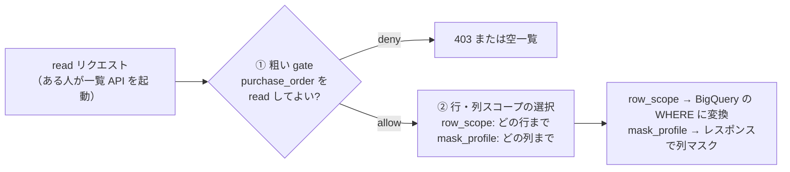
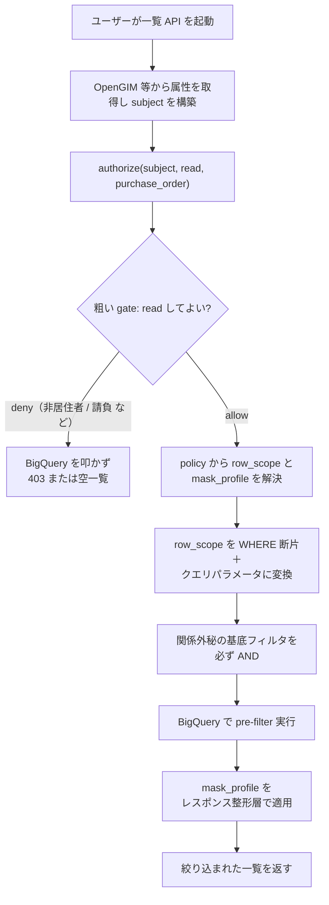

# PyCasbin ポリシー定義例（注文伝票・参照系）

> ステータス: 調査メモ（PyCasbin 初心者向けの policy 記述例）
> 情報時点: 2026年6月
> スコープ: BigQuery からのデータ取得（参照 / read）を前提とする。更新系（update / write）は後回しとし、本メモでは深入りしない。
> Sources（MCP 経由で確認）: PyCasbin README, `examples/abac_rule_model.conf`, `examples/rbac_with_deny_model.conf`, `tests/benchmarks/benchmark_model.py`
> Related: `basic-specification.md`, `row-scope-to-bigquery-implementation.md`（BQ 展開の実装・別紙）, `single-record-final-check.md`（詳細画面の1件チェック・別紙）, `../authorization-strategy.md`, `../authorization-boundaries-and-interface.md`, `../row-level-filtering-layering.md`

---

## 1. この文書の目的

注文伝票 `purchase_order` を題材に、PyCasbin の model と policy をどう書くかを、ケース別に整理する。本メモは **BigQuery に蓄積された注文伝票を参照（read）する経路** に絞る。PERM 構文や RBAC/ABAC の全体像は [`basic-specification.md`](basic-specification.md) を参照すること。

ねらいは 2 つ。**(1) さまざまな場合に、ルール（policy）をどう書き分けるか**。**(2) そのルールが BigQuery のクエリにどう展開されるか**のイメージを持てるようにすること。Python や PDP（Policy Decision Point）に初めて触れる読者を想定する。

**主経路は一覧フィルタである。** 想定するユースケースは「ある人がカタログ上の API を起動すると、その人の権限に応じて、伝票の一覧が絞り込まれて返ってくる」である。これは 1 件ずつ可否を判定する話ではなく、**権限に応じた絞り込み条件（WHERE）を生成して BigQuery に押し下げる**話だ。



読みやすさのため、込み入った話は 2 つの別紙に切り出した。本メモは概念・図・ルールの書き方に集中する。

- **込み入った Python 実装**（`row_scope` を BigQuery の WHERE に落とす実装）→ 別紙 [`row-scope-to-bigquery-implementation.md`](row-scope-to-bigquery-implementation.md)。
- **詳細画面の 1 件チェック**（一覧で絞った後、1 件開いたときの最終確認）→ 別紙 [`single-record-final-check.md`](single-record-final-check.md)。これは主経路ではなく補助なので別紙に分けた。

本メモの構成は、初めて読む人がイメージを積み上げやすい順にした。

1. **基本的な仕組み**（§2）— 2 段の裁き、扱う属性、特性のあるコードの捌き方、`row_scope` を policy で選ぶ仕組み。
2. **実例**（§3）— ケース別に「一覧でどう書くか」を示す。
3. **補足**（§4）— 社員区分の詳細、未決の判断ポイント、パターン早見表など。
4. **BigQuery への展開のイメージ**（§5）— `row_scope` が実際にどんな WHERE になるか。

---

## 2. 基本的な仕組み

### 2.1 2 段の裁き

PyCasbin は SQL の `WHERE` 句を自動生成しない。そこで本プロジェクトでは、PyCasbin に次の 2 つだけを担わせる（[`../authorization-boundaries-and-interface.md`](../authorization-boundaries-and-interface.md) の「2 段の裁き」と整合）。

1. **粗い gate**: このユーザーがそもそも `purchase_order` を read してよいか（モデル単位の allow / deny）。
2. **行・列スコープの選択**: どの行まで見えるか（`row_scope`）、どの列まで見えるか（`mask_profile`）。

`row_scope` / `mask_profile` を実際の `WHERE` や列マスクに変換するのはアプリケーション側の仕事である（§5）。

### 2.2 扱う属性

認証済みユーザーの属性は OpenGIM 等から取得して `r.sub` に載せる。注文伝票の属性は **BigQuery の行** を `r.obj` に載せる。一覧検索では条件生成のために subject 属性を使う。

```text
subject:
  id: "M123456"                     # ユーザーID。アルファベット1文字＋数字6桁
  department_code: "0A0B03020100"   # 所属コード。12桁。2桁ずつ組織階層を表す（§2.3）
  position_code: "11A"              # 役職コード。順序比較できない人事コード（§2.3）
  employee_type: 1                  # 1=社員 / 2=グループ会社社員 / 3=派遣社員 / 4=請負社員（§4.1）
  country_of_residence: "JP"        # ISO 3166-1 alpha-2。日本居住者は "JP"

order:  # BigQuery purchase_order テーブルの 1 行に対応
  model: "purchase_order"
  order_id: "PO-2026-0001"
  created_by: "M123456"             # 起票者の user_id
  approver_id: "M654321"            # 承認者。複数運用なら approver_ids のリストにする
  department_code: "0A0B03020100"   # この伝票が属する組織の12桁コード
  status: "draft"                   # 参照系では絞り込みに使う程度
  confidentiality: "normal"         # normal / restricted。restricted は関係外秘
  approval_amount: 1200000
```

用語の対応:

| 記号 | 意味 |
|---|---|
| `r` | `enforce()` に渡すリクエスト（`r.sub`, `r.obj`, `r.act`） |
| `p` | CSV などに書く policy 行 |
| `g` | ユーザーとロールの対応（RBAC） |
| `m` | request と policy を照合する matcher 式 |

### 2.3 特性のあるコードをどう捌くか

PyCasbin の matcher（simpleeval）は、等値・大小比較・論理演算といった素直な式しか書けない。一方で業務コードには「文字列の一部が意味を持つ」「順序比較できない」といった**特性**がある。こうしたコードは、**subject を組み立てる段階で扱いやすい派生属性や安全なキーに落とし、matcher では等値・範囲のような単純な比較に寄せる**のが基本方針である。所属コードと役職コードはその代表例で、扱いの型は次の 2 つに分かれる。コードそのものの説明は最小限にとどめ、捌き方に集中する。

**(a) 前方一致で階層を表すコード（所属コード `department_code`）**

`department_code` は 12 桁の英数字で、先頭から 2 桁ずつが組織階層（本部・事業部・部・グループ…）を表す。「同じ◯◯か」は **先頭一致（プレフィックス）** で判定する。たとえば自分が `0A0B03020100` なら、`0A0B03`（先頭 6 桁）で始まる伝票は「同じ部」。

| 判定したい階層 | 先頭一致の桁数 |
|---|---|
| 事業部 | 4 |
| 部 | 6 |
| グループ | 8 |

本メモは「自部門」を **部レベル（先頭 6 桁）** の既定とする。グループ単位など別レベルが要るなら桁数を変えるだけでよい。

捌き方は経路で 2 通り。**一覧**では前方一致を **範囲比較**（`department_code BETWEEN @lo AND @hi`）へ展開する。`STARTS_WITH` / `LIKE` はクラスタ列を関数で包むため block pruning が効かないので、範囲に直してプルーニングを効かせる。**1 件単位**では先頭 6 桁の派生キー `dept_section` の等値で見る。範囲展開の実装と桁マッピングの一覧は別紙 [`row-scope-to-bigquery-implementation.md`](row-scope-to-bigquery-implementation.md) §3 にある。

**(b) 順序比較できないコード（役職コード `position_code`）**

役職は `11A`（一般）・`31A`（グループ長）・`41A`（部長）のような人事コードで持つ。コードは数値ランクではないため、`>=` で「グループ長以上か」を判定できない。そこで subject 構築時に、グループ長以上に相当するコード一覧と突き合わせて派生フラグ `is_group_leader_or_above` を立て、policy ではそのフラグを参照する。コード一覧の保守は OpenGIM / 人事マスタ側に寄せ、policy にコードを直書きしない。

どちらも発想は同じ——**コードの特性は subject 構築時に吸収し、policy には「安全なキー」か「真偽の派生フラグ」しか見せない**。新しいコード体系が増えても、この流儀に揃えれば matcher を単純なまま保てる。

### 2.4 `row_scope` を policy で選ぶ

PyCasbin に自由 SQL を書かせず、レビュー済みの `row_scope` を policy で選ばせる。アプリケーション側は `row_scope` を条件 AST や BigQuery の `WHERE` に変換する。BigQuery 参照系では、これが主経路になる。

model:

```ini
[request_definition]
r = sub, obj, act

[policy_definition]
p = role, obj, act, cond, row_scope, mask_profile, eft

[role_definition]
g = _, _

[policy_effect]
e = some(where (p.eft == allow)) && !some(where (p.eft == deny))

[matchers]
m = r.obj.model == p.obj && \
    r.act == p.act && \
    (p.role == "*" || g(r.sub.id, p.role)) && \
    eval(p.cond)
```

policy:

```csv
# 日本居住者以外は何も取得できない
p, *, purchase_order, read, r.sub.country_of_residence != "JP", none, none, deny

# 請負社員は見られない（employee_type == 4）
p, *, purchase_order, read, r.sub.employee_type == 4, none, none, deny

# 一般の注文閲覧者: 自分が起票した伝票だけ
p, order_reader, purchase_order, read, r.sub.country_of_residence == "JP" && r.sub.employee_type != 4, own_created, decision_amount_masked, allow

# 部門内レビュー担当: 自部門（部レベル）で他人が起票した伝票だけ
p, department_order_reviewer, purchase_order, read, r.sub.country_of_residence == "JP" && r.sub.employee_type != 4, same_department_others, decision_amount_masked, allow

# グループ長以上: 自部門の伝票を見られ、決裁金額も見える
p, department_manager, purchase_order, read, r.sub.country_of_residence == "JP" && r.sub.employee_type != 4 && r.sub.is_group_leader_or_above == true, same_department_all, decision_amount_visible, allow

# 購買管理者: 全社の伝票を見られ、決裁金額も見える
p, purchasing_admin, purchase_order, read, r.sub.country_of_residence == "JP" && r.sub.employee_type != 4, all_departments, decision_amount_visible, allow

# ロール付与
g, M100001, order_reader
g, M100002, department_order_reviewer
g, M100003, department_manager
g, M100004, purchasing_admin
```

> matcher と policy_effect は PyCasbin で成立する書き方になっている。`e = some(where (p.eft == allow)) && !some(where (p.eft == deny))` は Casbin 組み込みの **allow-and-deny**（deny 優先）effect で、独自式ではない（`examples/rbac_with_deny_model.conf` で確認）。`eval(p.cond)` は ABAC の標準手法で、policy 側に書いた条件式を実行時に評価する（`examples/abac_rule_model.conf` で確認）。詳細は [`basic-specification.md`](basic-specification.md) §4・§7 を参照。
>
> なお PyCasbin はポリシー CSV をトップレベルのカンマで分割するため、**condition 式にトップレベルのカンマを書かない**。`r.sub.country_of_residence == "JP"` のような埋め込み二重引用符は問題ない（カンマを含まないため）。詳細は別紙 [`row-scope-to-bigquery-implementation.md`](row-scope-to-bigquery-implementation.md) §6.1。

`row_scope` は PyCasbin に評価させる SQL ではなく、アプリケーションが理解する安全なキーである。`department_code` の前方一致は範囲比較に展開する（§2.3・§5）。

| row_scope | 意味 | BigQuery に変換する条件例 |
|---|---|---|
| `own_created` | 自分が起票した伝票だけ | `created_by = @subject_id` |
| `same_department_others` | 自部門（部レベル）で、他人が起票した伝票だけ | `department_code BETWEEN @dept_lo AND @dept_hi AND created_by != @subject_id` |
| `same_department_all` | 自部門（部レベル）の伝票 | `department_code BETWEEN @dept_lo AND @dept_hi` |
| `all_departments` | 全社の伝票 | 条件なし、またはテナント条件のみ |
| `none` | データ行を返さない | `FALSE` |

`@dept_lo` / `@dept_hi` は、subject の `department_code` の先頭 6 桁（部レベル）から作る前方一致の閉区間である（§5・別紙 §3）。グループ単位にしたいなら先頭 8 桁にした `same_group_all` のような row_scope を足せばよい。

`mask_profile` も同じ考え方で、PyCasbin が列を削るのではなく、レスポンス整形層が適用するキーである。

| mask_profile | 意味 | 適用例 |
|---|---|---|
| `decision_amount_visible` | 決裁金額をそのまま返す | `approval_amount` を返す |
| `decision_amount_masked` | 決裁金額を隠す | `approval_amount` を `null`、`"***"`、またはフィールド除外にする |
| `none` | 列マスクが不要 | マスク処理なし |

重要なのは、`enforce()` は標準では boolean を返すだけで、`row_scope` や `mask_profile` を返してくれるわけではない点である。本プロジェクトでは、`authorize(subject, action, resource) -> Decision` ラッパーの内側で allow/deny 判定と `row_scope` / `mask_profile` の解決をまとめて行い、`Decision(effect, row_scope, mask_profile, ...)` を組み立てる。FastAPI のハンドラや BigQuery 呼び出し側に Casbin の policy 形式を漏らさない。この解決方法の具体的な選択肢は別紙 [`row-scope-to-bigquery-implementation.md`](row-scope-to-bigquery-implementation.md) §7 を参照。

行ごとに変わる属性（`confidentiality` など）は subject 属性から選ぶ `row_scope` では表せない。そうした条件は全ロール共通の基底フィルタとして別に `WHERE` へ AND する（実例 §3.6・展開イメージ §5）。

---

## 3. 実例（ケース別の policy）

ここでは各ケースについて、**主経路である一覧の書き方**を示す。一覧で絞り込んだ後、詳細画面で 1 件開いたときの最終確認（1 件単位の `enforce()`）は補助であり、別紙 [`single-record-final-check.md`](single-record-final-check.md) にまとめた。

### 3.1 日本居住者以外は何も取得できない

居住国はユーザ属性（`r.sub`）だけで判定できる。全ロール共通のゲートとして、deny policy を先頭に置く。

```csv
p, *, purchase_order, read, r.sub.country_of_residence != "JP", none, none, deny
```

`country_of_residence` の正本は OpenGIM とし、未設定や不明値は deny 側に倒す運用が安全である。allow 側は `== "JP"` のみ許可し、`null` や空文字は deny policy に一致させる。

```csv
p, *, purchase_order, read, r.sub.country_of_residence != "JP" || r.sub.country_of_residence == "", none, none, deny
```

API の入口では、BigQuery を呼ぶ前に `authorize()` で subject だけを見て早期 deny してもよい。ポリシー表現と実装の二重化になるため、どちらかを正本にし、もう一方はテストで同期する。

### 3.2 自分が起票した伝票だけ見たい

policy は `own_created` を返す設計にする。

```csv
p, order_reader, purchase_order, read, r.sub.country_of_residence == "JP" && r.sub.employee_type != 4, own_created, decision_amount_masked, allow
```

アプリケーション側では `own_created` を BigQuery の `created_by = @subject_id` に変換する（§5・別紙）。

### 3.3 自分の部で他の人が起票した伝票だけ見たい

「自分の部」は `department_code` の **先頭 6 桁一致**（§2.3）で判定する。`same_department_others` を使う。

```csv
p, department_order_reviewer, purchase_order, read, r.sub.country_of_residence == "JP" && r.sub.employee_type != 4, same_department_others, decision_amount_masked, allow
```

アプリケーション側では、subject の `department_code` 先頭 6 桁から作る前方一致レンジを使い、`department_code BETWEEN @dept_lo AND @dept_hi AND created_by != @subject_id` に変換する（`STARTS_WITH(department_code, @dept_prefix) AND created_by != @subject_id` と同義だが、クラスタ列のプルーニング対策で range にする。§5・別紙 §3）。

### 3.4 グループ長以上だったら決裁金額の欄が見える

列レベルの制御は PyCasbin のネイティブ責務ではない。PyCasbin では「決裁金額を読める属性・ロールか」を判定し、実際のマスクはレスポンス整形層で行う。

役職コード（`11A` など）は順序比較できないため、「グループ長以上か」は subject 構築時に派生フラグ `is_group_leader_or_above` として解決しておく（§2.3）。一覧 policy では、グループ長以上の policy だけ `mask_profile` を `decision_amount_visible` にする。

```csv
p, department_manager, purchase_order, read, r.sub.country_of_residence == "JP" && r.sub.employee_type != 4 && r.sub.is_group_leader_or_above == true, same_department_all, decision_amount_visible, allow
```

より明示的に、列ごとに別 action として判定してもよい。

model:

```ini
[request_definition]
r = sub, obj, act

[policy_definition]
p = obj, act, cond, eft

[policy_effect]
e = some(where (p.eft == allow)) && !some(where (p.eft == deny))

[matchers]
m = r.obj == p.obj && r.act == p.act && eval(p.cond)
```

policy:

```csv
p, purchase_order.approval_amount, read_column, r.sub.country_of_residence == "JP" && r.sub.employee_type != 4 && r.sub.is_group_leader_or_above == true, allow
p, purchase_order.approval_amount, read_column, r.sub.country_of_residence != "JP", deny
p, purchase_order.approval_amount, read_column, r.sub.employee_type == 4, deny
```

呼び出し側:

```python
can_read_amount = enforcer.enforce(subject, "purchase_order.approval_amount", "read_column")
```

`False` の場合、`approval_amount` を返さない。`True` の場合だけ実値を返す。BigQuery 側では、マスク対象列を最初から `SELECT` しない実装にしてもよい。

### 3.5 社員の区分が請負の人は見られない

請負社員（`employee_type == 4`）を全体 deny にするなら、`eft = deny` の policy を置く。

```csv
p, *, purchase_order, read, r.sub.employee_type == 4, none, none, deny
```

この deny を効かせるには、model の `policy_effect` を deny-aware にしておく。

```ini
[policy_effect]
e = some(where (p.eft == allow)) && !some(where (p.eft == deny))
```

これで、ある請負社員に誤って `order_reader` ロールが付与されていても、請負 deny が同時に一致すれば最終結果は deny になる。日本居住者かどうかより後ろに書いても、`policy_effect` 上はどちらの deny が一致しても拒否される。

なお `2`（グループ会社社員）・`3`（派遣社員）は現状この deny の対象外（社員と同じ扱い）。これらに別の絞り込みが要るかは未決の判断ポイントで、確定したら deny 行や allow 条件を追加する（§4.1）。

### 3.6 関係外秘の伝票は本人と承認者だけが見られる

「関係外秘」は、グループ長や購買管理者であっても見せたくない、伝票単位の機密区分である。注文行の `confidentiality == "restricted"` で表し、起票者本人（`created_by`）と承認者（`approver_id`）以外は read を deny する。

一覧検索では、この deny は **行ごとの属性**に依存するため `row_scope` では選べない。代わりに、ロール別 `row_scope` から生成した `WHERE` に、全ロール共通の基底フィルタを AND する。

```sql
AND (confidentiality != 'restricted' OR created_by = @subject_id OR approver_id = @subject_id)
```

これで、購買管理者の `all_departments` であっても、関係外秘の伝票は本人か承認者でない限り結果に出てこない。

承認者が複数の場合は、`approver_id` の単一比較ではなく承認者集合への所属判定にする。subject 構築時に「自分がこの伝票の承認者か」を派生フラグへ落とすか、`approver_ids` リストへの所属判定にする。

| confidentiality | 意味 | 見られる人 |
|---|---|---|
| `normal` | 通常 | ロール・属性ベースの通常判定に従う |
| `restricted` | 関係外秘 | 起票者本人（`created_by`）と承認者（`approver_id`）だけ |

検索時点では `normal` でも、詳細取得の直前に `restricted` へ変わっている可能性がある。詳細画面で 1 件取得した後は、別紙 [`single-record-final-check.md`](single-record-final-check.md) の 1 件単位 deny で最終確認する。

---

## 4. 補足

### 4.1 employee_type（社員区分）と未決の判断ポイント

`employee_type` は数値コードで持つ。subject 構築時と policy で型（int / str）を揃える。

| code | 区分 |
|---|---|
| `1` | 社員 |
| `2` | グループ会社社員 |
| `3` | 派遣社員 |
| `4` | 請負社員 |

本メモの参照系ルールでは、従来どおり **請負社員（`4`）を deny** とする（§3.5）。`2`（グループ会社社員）・`3`（派遣社員）は現状 `1`（社員）と同じ扱い（許可側）としているが、これらに別の絞り込みが要るかは**未決の判断ポイント**であり、確定したら policy に反映する。

### 4.2 属性定義の置き場所

`department_code` の階層、`position_code`、`employee_type` のコード、ID 形式といった属性定義は、`purchase_order` 固有ではなくモデル横断で使う。現状は本メモにのみ記載しているが、モデルが増えたら [`basic-specification.md`](basic-specification.md) 等の共通リファレンスへ集約するのがよい。

### 4.3 更新系は後回し

本メモは参照系（read）に絞る。下書き伝票の更新可否（起票者のみ・`status` が `draft` のときだけ等）や、確定済み伝票の更新禁止といった write 系のポリシーは、更新 API の設計が固まってから別途整理する。

その際も、参照系で使った道具立て（`r.obj.status` を見る ABAC、`eft = deny` と deny-aware な `policy_effect`、検索時点の `status` が更新直前に変わり得る点を考慮した「対象行を取得して最新 `status` で 1 件単位の deny を再評価する」流れ）はそのまま流用できる。

### 4.4 `row_scope` 方式と AST 方式の関係

本メモの `row_scope` 方式は「レビュー済みの安全なキーを選ばせる」割り切りであり、[`../authorization-boundaries-and-interface.md`](../authorization-boundaries-and-interface.md) が描く `Decision.row_filter`（条件 AST を返し、汎用に WHERE へ翻訳する）方式のうち、PyCasbin の表現力に合わせた具体版という位置づけである。Cerbos PlanResources / OPA Compile を採る場合は AST 方式になる。どちらを採るかは authorization-boundaries-and-interface の未決事項（ポリシー言語/エンジンの最終比較）と連動する。

### 4.5 どのパターンを選ぶか（早見表）

- 一覧検索や BigQuery へのプッシュダウン（**参照系の主経路**）: `row_scope` を policy で選び、アプリケーション側で `WHERE` に変換する（§2.4・§5、実装は別紙）。
- 詳細画面の最終チェック・取得直前の再評価: 1 件単位の ABAC policy。BigQuery から取得した 1 行を `r.obj` に載せて `enforce()` する（別紙 [`single-record-final-check.md`](single-record-final-check.md)）。
- 所属（部・グループなど）による絞り込み: `department_code` の前方一致。一覧では range（`BETWEEN @dept_lo AND @dept_hi`）に展開してクラスタ列のプルーニングを効かせ、1 件単位では派生キー `dept_section` の等値で見る（§2.3・§5）。
- 列表示制御: `mask_profile` を返すか、`read_column` のような別 action で判定する（§3.4）。
- 役職コードによる閾値判定（グループ長以上など）: コードは順序比較できないので、subject 構築時に派生フラグ（`is_group_leader_or_above`）へ落とし、policy ではフラグを参照する（§2.3）。
- 伝票単位の機密区分（関係外秘など）: 行属性に依存する deny は、一覧では全ロール共通の基底フィルタとして `WHERE` に AND し（§3.6）、1 件単位では `eft = deny` の ABAC で最終確認する（別紙）。
- 居住国・社員区分・退職者・凍結アカウントのような強い拒否条件: `eft = deny` と deny-aware な `policy_effect` を使う。複数の deny は OR ではなく「いずれかが一致したら拒否」として効く（請負社員 `employee_type == 4` もここ）。
- ロールだけで決まるもの: `g, user, role` の RBAC を使う。
- 行の属性とユーザー属性の組み合わせで決まるもの: `eval(p.cond)` の ABAC を使う。
- 更新系（update / write）: 本メモのスコープ外。設計が固まってから別途整理する（§4.3）。

---

## 5. BigQuery への展開のイメージ

`authorize()` が返した `Decision`（`row_scope` / `mask_profile`）を、アプリケーション側が BigQuery のパラメータ化クエリへ落とす。**込み入った Python 実装は別紙 [`row-scope-to-bigquery-implementation.md`](row-scope-to-bigquery-implementation.md) に切り出した**ので、ここでは「何が起きるか」のイメージだけを示す。



押さえどころは 4 つ（いずれも実装は別紙）。

- **(a)** ユーザー由来値は文字列連結せず必ずクエリパラメータ（`@param`）で渡す（SQL インジェクション対策）。
- **(b)** `department_code` の前方一致は範囲比較（`BETWEEN`）に展開し、クラスタ列のプルーニングを効かせる（§2.3）。
- **(c)** 関係外秘の基底フィルタは `row_scope` と別に必ず AND する（§3.6）。
- **(d)** `deny` / `none` は BigQuery を叩く前に短絡し、無駄なスキャン課金を避ける。

### 5.1 具体例で見る: order_reader の田中さんが一覧を開く

1. 認証後、subject を組み立てる: `id="M100001"`, `department_code="0A0B03020100"`, `employee_type=1`, `country_of_residence="JP"`。
2. `authorize(subject, "read", purchase_order)` を呼ぶ。
   - 非居住者 deny? → いいえ。請負 deny? → いいえ。→ **allow**。
   - 田中さんは `order_reader` ロール → `row_scope = own_created`、`mask_profile = decision_amount_masked`。
3. `row_scope = own_created` を WHERE 断片 `created_by = @subject_id` に変換する。
4. 全ロール共通の関係外秘フィルタを AND する。
5. 生成される SQL（イメージ）:

```sql
SELECT order_id, created_by, department_code, status, approval_amount
FROM `proj.authz_views.purchase_order`
WHERE (created_by = @subject_id)
  AND (confidentiality != 'restricted' OR created_by = @subject_id OR approver_id = @subject_id)
-- @subject_id = "M100001"
```

6. `mask_profile = decision_amount_masked` なので、返却時に `approval_amount` を隠す（一般閲覧者には決裁金額を見せない）。

### 5.2 row_scope ごとに生成される WHERE のイメージ

同じ仕組みで、ロール（＝選ばれる `row_scope`）が変わると WHERE だけが差し替わる。`SELECT` と関係外秘フィルタは共通である。

**`same_department_others`（部門内レビュー担当）** — 「自分の部」を先頭 6 桁の前方一致 → 範囲で表す:

```sql
WHERE (department_code BETWEEN @dept_lo AND @dept_hi AND created_by != @subject_id)
  AND (confidentiality != 'restricted' OR created_by = @subject_id OR approver_id = @subject_id)
-- @dept_lo = "0A0B03000000", @dept_hi = "0A0B03ZZZZZZ"  ← 先頭6桁=部 の前方一致を範囲で表現
-- @subject_id = "M100002"
```

**`all_departments`（購買管理者）** — 行は絞らないが、関係外秘フィルタは必ず効く:

```sql
WHERE (TRUE)
  AND (confidentiality != 'restricted' OR created_by = @subject_id OR approver_id = @subject_id)
-- @subject_id = "M100004"
```

→ 購買管理者であっても、関係外秘（`restricted`）の伝票は本人か承認者でない限り結果に出てこない（§3.6）。

**`none` / `deny`** — BigQuery を叩かず短絡（空一覧 or 403）。例えば非居住者の一覧では、deny が先に効いて `row_scope` は常に `none` 相当になるため、スキャン課金を払わずに空一覧を返してよい。

`row_scope` ごとの条件の早見表は §2.4 の表を参照。範囲展開・パラメータ集約・fail-safe の実装は別紙 §3〜§5 にまとめてある。

---

## 6. 関連ドキュメント

- [`row-scope-to-bigquery-implementation.md`](row-scope-to-bigquery-implementation.md): 別紙。`row_scope` を BigQuery の WHERE に展開する Python 実装（前方一致の範囲展開、パラメータ集約、fail-safe、CSV カンマの注意、`authorize()`/`Decision` の解決）。
- [`single-record-final-check.md`](single-record-final-check.md): 別紙。詳細画面で 1 件開いたときの最終チェック（1 件単位の `enforce()`、ABAC policy、time-of-check / time-of-use のずれ対策）。
- [`basic-specification.md`](basic-specification.md): PyCasbin の基本仕様と PERM 構文。
- [`../row-level-filtering-layering.md`](../row-level-filtering-layering.md): 行レベル絞り込みの層分担（判断は API、執行は BigQuery 押し下げ WHERE）。
- [`../authorization-boundaries-and-interface.md`](../authorization-boundaries-and-interface.md): `authorize()` と `Decision` のインターフェース、2 段の裁き。
</content>
</invoke>
