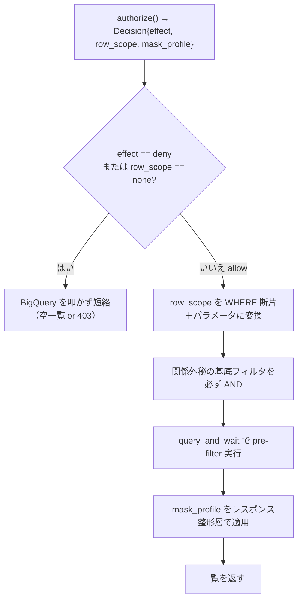

# 別紙: row_scope を BigQuery の WHERE に展開する実装

> ステータス: 調査メモ（実装担当者向けの詳細別紙）
> 情報時点: 2026年6月
> スコープ: [`policy-examples-purchase-order.md`](policy-examples-purchase-order.md) で示した `row_scope` / `mask_profile` を、実際に BigQuery のパラメータ化クエリへ落とす Python 実装。
> Related: `policy-examples-purchase-order.md`（親）, `single-record-final-check.md`（詳細画面の1件チェック・別紙）, `basic-specification.md`, `../row-level-filtering-layering.md`, `../authorization-boundaries-and-interface.md`

---

## 1. この別紙の位置づけ

親ドキュメント [`policy-examples-purchase-order.md`](policy-examples-purchase-order.md) は、**ルールの定義方法**（どんなケースでどんな policy を書くか）と **BigQuery への展開イメージ**（`row_scope` がどんな `WHERE` になるか）に集中している。Python に不慣れな読者は、親ドキュメントだけで全体像をつかめるようにしてある。

本別紙は、その親ドキュメントが「アプリケーション側で `row_scope` を `WHERE` に変換する」と書いた部分の、**込み入った Python 実装**を切り出したものである。実際に手を動かす実装フェーズで参照する。

対象は参照系（read）の一覧取得経路に限る。語彙（`own_created` / `same_department_others` / `decision_amount_masked` など）は親ドキュメントの定義に従う。

---

## 2. 全体の流れ

`authorize()` が返した `Decision`（`effect` / `row_scope` / `mask_profile`）を、BigQuery のパラメータ化クエリに落とす流れは次の通り。



実装のポイントは 4 つ。

- **(a)** ユーザー由来値は文字列連結せず必ずクエリパラメータ（`@param`）で渡す。
- **(b)** `department_code` の前方一致は範囲比較に展開し、クラスタ列のプルーニングを効かせる。
- **(c)** 関係外秘の基底フィルタは `row_scope` と別に必ず AND する。
- **(d)** `deny` / `none` は BigQuery を叩く前に短絡し、無駄なスキャン課金を避ける。

---

## 3. 前方一致を範囲比較に展開する

`department_code` の「同じ部か」は前方一致（プレフィックス）で判定するが、`STARTS_WITH` / `LIKE` はクラスタ列を関数で包むため block pruning が効かない。そこで前方一致を閉区間 `[lo, hi]` に展開する。

```python
DEPT_CODE_LEN = 12  # department_code は12桁固定

# 組織階層 → 前方一致の桁数
DEPT_LEVEL_DIGITS = {
    "domain": 2, "division": 4, "section": 6,   # section = 部
    "group": 8, "team": 10, "squad": 12,
}


def dept_prefix_range(department_code: str, level: str) -> tuple[str, str]:
    """階層レベルの前方一致を、閉区間 [lo, hi] に展開する。

    STARTS_WITH / LIKE はクラスタ列を関数で包むため block pruning が効かない。
    range 比較なら department_code を素のまま比較するのでプルーニングが効く。
    code は英数字（0-9, A-Z）想定で、'0' が最小・'Z' が最大の文字。
    """
    n = DEPT_LEVEL_DIGITS[level]
    prefix = department_code[:n]
    pad = DEPT_CODE_LEN - n
    lo = prefix + "0" * pad          # 例: 0A0B03 -> 0A0B03000000
    hi = prefix + "Z" * pad          # 例: 0A0B03 -> 0A0B03ZZZZZZ
    return lo, hi
```

`dept_prefix_range("0A0B03020100", "section")` は `("0A0B03000000", "0A0B03ZZZZZZ")` を返し、`department_code BETWEEN @dept_lo AND @dept_hi` が「同じ部」を表す。`STARTS_WITH(department_code, "0A0B03")` と同義だが、クラスタ列を関数で包まないぶんプルーニングが効く。グループ単位なら `level="group"`（先頭 8 桁）にするだけでよい。

---

## 4. Decision を WHERE に変換する

`row_scope` を `WHERE` 断片＋クエリパラメータに変換する中核。**同名パラメータを 1 つに集約**し（`@subject_id` を複数箇所で参照しても重複登録しない）、**未知キーは `FALSE`（行を返さない）に倒す fail-safe** にしている。

```python
from dataclasses import dataclass, field
from google.cloud import bigquery


@dataclass
class Decision:
    """authorize() が返す判定結果（本メモで使う部分のみ抜粋）。"""
    effect: str                              # "allow" | "deny"
    row_scope: str = "none"                  # authorize() が選んだ安全なキー
    mask_profile: str = "none"
    subject_id: str = ""                     # 例: "M123456"
    department_code: str = ""                # 例: "0A0B03020100"（12桁）
    section_codes: list[str] = field(default_factory=list)  # 複数の部を統括する場合


def build_list_query(decision: Decision) -> tuple[str, list]:
    """Decision を「パラメータ化 SQL ＋ クエリパラメータ」に変換する。"""
    # 同名パラメータを 1 つに集約する（@subject_id を複数箇所で参照しても重複登録しない）。
    params: dict[str, object] = {}

    def put(p) -> None:
        params[p.name] = p

    # ① row_scope（安全なキー）→ WHERE 断片
    scope = decision.row_scope
    if scope == "own_created":
        put(bigquery.ScalarQueryParameter("subject_id", "STRING", decision.subject_id))
        scope_clause = "created_by = @subject_id"

    elif scope in ("same_department_others", "same_department_all"):
        # 「自部門」= 部レベル（先頭6桁）の前方一致を range に展開（プルーニング対策）。
        lo, hi = dept_prefix_range(decision.department_code, "section")
        put(bigquery.ScalarQueryParameter("dept_lo", "STRING", lo))
        put(bigquery.ScalarQueryParameter("dept_hi", "STRING", hi))
        scope_clause = "department_code BETWEEN @dept_lo AND @dept_hi"
        if scope == "same_department_others":
            put(bigquery.ScalarQueryParameter("subject_id", "STRING", decision.subject_id))
            scope_clause += " AND created_by != @subject_id"

    elif scope == "managed_sections":         # 複数の部を統括（前方一致の OR）
        clauses = []
        for i, code in enumerate(decision.section_codes):
            lo, hi = dept_prefix_range(code, "section")
            put(bigquery.ScalarQueryParameter(f"dept_lo_{i}", "STRING", lo))
            put(bigquery.ScalarQueryParameter(f"dept_hi_{i}", "STRING", hi))
            clauses.append(f"department_code BETWEEN @dept_lo_{i} AND @dept_hi_{i}")
        scope_clause = "(" + " OR ".join(clauses) + ")" if clauses else "FALSE"

    elif scope == "all_departments":
        scope_clause = "TRUE"                 # テナント条件があればここで AND する

    else:                                     # "none" と未知キーは行を返さない（fail-safe）
        scope_clause = "FALSE"

    # ② 関係外秘の基底フィルタ（全ロール共通で必ず AND）。行ごとに変わる
    #    confidentiality は row_scope では選べないため、ここで処理する。
    put(bigquery.ScalarQueryParameter("subject_id", "STRING", decision.subject_id))
    restricted_clause = (
        "(confidentiality != 'restricted' "
        "OR created_by = @subject_id "
        "OR approver_id = @subject_id)"
    )

    sql = f"""
        SELECT order_id, created_by, department_code, status, approval_amount
        FROM `proj.authz_views.purchase_order`
        WHERE ({scope_clause})
          AND {restricted_clause}
    """
    return sql, list(params.values())
```

---

## 5. マスク適用と実行

`mask_profile` はレスポンス整形層で適用する（PyCasbin は列を削らない）。`deny` / `none` は BigQuery を叩く前に短絡する。最新クライアント（3.x 系）で推奨される `client.query_and_wait()` を使う。

```python
def apply_mask(row: dict, mask_profile: str) -> dict:
    """mask_profile（安全なキー）→ レスポンス整形。PyCasbin は列を削らない。"""
    if mask_profile == "decision_amount_masked":
        row["approval_amount"] = None        # フィールドごと除外でも可
    # "decision_amount_visible" / "none" はそのまま返す
    return row


def list_purchase_orders(decision: Decision) -> list[dict]:
    # deny / none は BigQuery を叩かずに短絡（無駄なスキャン課金を避ける）。
    if decision.effect == "deny" or decision.row_scope == "none":
        return []

    client = bigquery.Client()
    sql, params = build_list_query(decision)
    job_config = bigquery.QueryJobConfig(query_parameters=params)

    rows = client.query_and_wait(sql, job_config=job_config)  # 3.x 系の推奨実行方法
    return [apply_mask(dict(row), decision.mask_profile) for row in rows]
```

---

## 6. 実装上の注意

- **前方一致は範囲で表す**。`dept_prefix_range` の展開は `department_code` が固定 12 桁・英数字（`0-9`, `A-Z`）であることを前提にしている。小文字や可変長を許す運用なら、`hi` の最大文字を見直す。
- **配列パラメータ（`ArrayQueryParameter` / `IN UNNEST(@x)`）は完全一致の集合向け**。前方一致では使えない（プレフィックスは集合の等値比較で表せない）ため、複数の部は range の OR で組む（`managed_sections`）。`IN UNNEST` が向くのは「明示列挙された末端コードの集合」や「`created_by IN UNNEST(@user_ids)` のような user_id の集合」など、値そのものを等値で照合する場合。
- `query_and_wait()` はクエリ投入と結果待ちをまとめて行う最新クライアントの推奨 API（旧来の `client.query(...).result()` でも可）。
- `build_list_query` には `row_scope` の既知キーしか書かない。未知キーが来たら `FALSE`（行を返さない）に倒す fail-safe にしておくと、policy 側のミスで意図せず全件露出する事故を防げる。
- マスクは BigQuery 側で「マスク対象列を最初から `SELECT` しない」実装にしてもよい。その場合は `mask_profile` に応じて `SELECT` 句を切り替える。

### 6.1 policy の condition 式にトップレベルのカンマを書かない（PyCasbin 固有の注意）

PyCasbin はポリシー CSV を**トップレベルのカンマで分割**して各フィールドに割り当てる。このとき `()` と `[]` のネストは保護されるが、**引用符は保護されない**（PyCasbin の行パーサ `_extract_tokens` の仕様）。したがって:

- `r.sub.country_of_residence == "JP"` のような**埋め込み二重引用符は問題ない**。カンマを含まないので 1 フィールドとして読まれ、`"JP"` はそのまま matcher（simpleeval）へ渡って文字列リテラルとして解釈される。親ドキュメントの例はすべてこの形で、誤りはない。
- 一方、条件式に**トップレベルのカンマ**を書くとフィールド境界と誤認される。`func(a, b)` や `x in ["a", "b"]` のように `()` / `[]` の中にあるカンマは保護されるので使えるが、`"a,b"` のような**引用符だけで囲んだカンマは保護されない**（Go 版 Casbin の「引用符で囲めばよい」という案内とは挙動が異なる点に注意）。
- 実務上は、複雑な条件は policy にカンマを持ち込まず、subject 構築時に派生フラグ（`is_group_leader_or_above` など）へ落として等値比較に寄せるのが安全。

---

## 7. `authorize()` が `Decision` を組み立てる方法

`enforce()` は標準では boolean を返すだけで、`row_scope` や `mask_profile` を返してくれるわけではない。`authorize(subject, action, resource) -> Decision` ラッパーの内側で、次のどちらかの形にして `Decision` を組み立てる。

1. PyCasbin で allow/deny を判定した後、Management API / RBAC API で候補 policy を取得し、同じ条件語彙で `row_scope` と `mask_profile` を解決する。
2. PyCasbin の model/policy と同じ語彙を使う自前 policy resolver を `authz_core` に置き、`Decision(effect, row_scope, mask_profile, ...)` を組み立てる。

本プロジェクトでは、`authorize()` の内側にこの解決処理を閉じ込め、FastAPI のハンドラや BigQuery 呼び出し側に Casbin の policy 形式を漏らさない。これにより、呼び出し側は「Casbin を意識せず `Decision` を受け取る」だけで済む。

---

## 8. 関連ドキュメント

- [`policy-examples-purchase-order.md`](policy-examples-purchase-order.md): 親。ルールの定義方法と BQ 展開イメージ（mermaid 図、ケース別 policy）。
- [`single-record-final-check.md`](single-record-final-check.md): 別紙。詳細画面で 1 件開いたときの最終チェック（1 件単位の `enforce()`）。
- [`basic-specification.md`](basic-specification.md): PyCasbin の基本仕様と PERM 構文。
- [`../row-level-filtering-layering.md`](../row-level-filtering-layering.md): 行レベル絞り込みの層分担（判断は API、執行は BigQuery 押し下げ WHERE）。
- [`../authorization-boundaries-and-interface.md`](../authorization-boundaries-and-interface.md): `authorize()` と `Decision` のインターフェース、認可判断を2段に分ける考え方。
