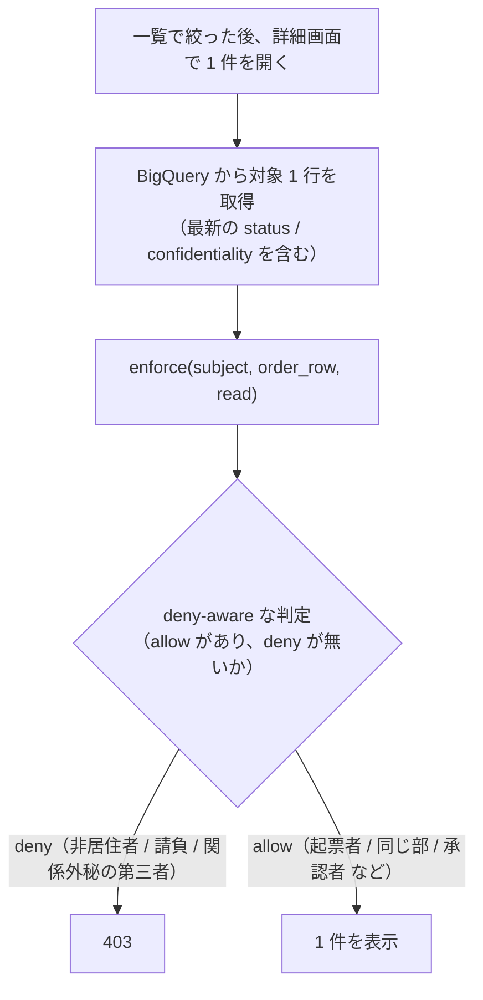

# 別紙: 詳細画面の 1 件チェック（1 件単位の最終確認）

> ステータス: 調査メモ（補助経路・1 件単位判定の別紙）
> 情報時点: 2026年6月
> スコープ: [`policy-examples-purchase-order.md`](policy-examples-purchase-order.md) の主経路（一覧フィルタ）で絞り込んだ後、詳細画面で 1 件開いたときの最終確認。参照系（read）に限る。
> Sources（MCP 経由で確認）: PyCasbin README, `examples/abac_rule_model.conf`, `examples/rbac_with_deny_model.conf`, `tests/benchmarks/benchmark_model.py`
> Related: `policy-examples-purchase-order.md`（親）, `row-scope-to-bigquery-implementation.md`, `basic-specification.md`, `../authorization-boundaries-and-interface.md`, `../row-level-filtering-layering.md`

---

## 1. この別紙の位置づけ

親ドキュメント [`policy-examples-purchase-order.md`](policy-examples-purchase-order.md) の主経路は **一覧フィルタ**である。権限に応じた `row_scope` を選び、BigQuery の `WHERE` に押し下げて絞り込む。1 件ずつ `enforce()` する方式は主経路ではない。

本別紙は、その**補助**として位置づく **1 件単位の最終チェック**を切り出したものである。一覧で絞り込んだ後、詳細画面で 1 件を開くときに、その 1 行を `r.obj` に載せて最終確認する。次の理由で必要になる。

- 一覧の `row_scope` は subject 属性で行集合を絞るが、**行ごとに変わる属性**（`confidentiality` など）の最終確認は 1 件単位の方が素直に書ける。
- 検索時点では `normal` でも、詳細取得の直前に `restricted` へ変わっている可能性がある（time-of-check / time-of-use のずれ）。取得した最新の 1 行で deny を再評価する。

この方式は、詳細画面で BigQuery から 1 行取得した後に確認する、または候補件数が少ない場合に向く。一方で、**一覧検索で BigQuery から大量データを取ってから 1 件ずつ `enforce()` するのは避ける**（主経路は親 §2.4 の `row_scope` → 親 §5 の WHERE 押し下げ）。

---

## 2. 仕組み

一覧で絞り込んだ後、詳細画面で 1 件を開くときは、その 1 行を `r.obj` に載せて最終チェックする。



このとき、ABAC の `eval()` に条件を置くのが一番わかりやすい。所属の階層判定は、subject と（取得済みの）注文行の双方で **部レベルの派生キー** `dept_section`（`department_code` の先頭 6 桁）を構築時に計算し、それを比較する。コードのスライスを matcher 式に持ち込まず、`is_group_leader_or_above` と同じ「派生属性に落とす」流儀に揃える（親 §2.3）。

model:

```ini
[request_definition]
r = sub, obj, act

[policy_definition]
p = obj, act, cond, eft

[policy_effect]
e = some(where (p.eft == allow)) && !some(where (p.eft == deny))

[matchers]
m = r.obj.model == p.obj && r.act == p.act && eval(p.cond)
```

policy:

```csv
# 日本居住者以外は何も取得できない（最優先で deny）
p, purchase_order, read, r.sub.country_of_residence != "JP", deny

# 自分が起票した伝票は見える
p, purchase_order, read, r.sub.country_of_residence == "JP" && r.sub.employee_type != 4 && r.obj.created_by == r.sub.id, allow

# 自分の部（先頭6桁一致）で、他の人が起票した伝票は見える
p, purchase_order, read, r.sub.country_of_residence == "JP" && r.sub.employee_type != 4 && r.obj.dept_section == r.sub.dept_section && r.obj.created_by != r.sub.id, allow

# 請負社員は見られない（employee_type == 4）
p, purchase_order, read, r.sub.employee_type == 4, deny

# 関係外秘の伝票は、本人（起票者）と承認者だけが見られる
p, purchase_order, read, r.obj.confidentiality == "restricted" && r.obj.created_by != r.sub.id && r.obj.approver_id != r.sub.id, deny
```

ポイント:

- `p.cond` には、`r.sub` と `r.obj` を使った条件式を文字列で書く。
- `eval(p.cond)` により、policy 側に書いた条件式が実行時に評価される（`examples/abac_rule_model.conf` で確認した ABAC ルール matcher の手法）。
- `r.obj` には BigQuery から取得した 1 行を、属性アクセスできるオブジェクト（dict 等）として載せる（`tests/benchmarks/benchmark_model.py` の `obj = {"Owner": ...}` と同じ要領）。
- `r.sub.dept_section` / `r.obj.dept_section` は構築時に `department_code[:6]` で計算した派生キー。matcher では等値比較だけにする。
- `policy_effect` は「少なくとも 1 つ allow があり、deny が 1 つもない」場合だけ許可する（Casbin 組み込みの allow-and-deny。`examples/rbac_with_deny_model.conf` で確認）。請負や非居住者を明示 deny にしておけば、誤って allow policy が増えても deny が勝つ。
- `r.sub.country_of_residence == "JP"` を各 allow にも入れているのは、deny だけに依存せず、allow policy 単体で読んでも意図がわかるようにするためである。
- 関係外秘の deny は `r.obj` の `confidentiality` / `created_by` / `approver_id` を見るので、これらの列が `r.obj` に載っている前提でしか評価できない。

Python 側の呼び出しイメージ:

```python
allowed = enforcer.enforce(subject, order, "read")
```

---

## 3. ケース別の 1 件単位 policy

親 §3 の各ケースについて、一覧（主経路）と対になる **1 件単位の確認**の書き方を示す。§2 の combined policy を分解したものなので、実運用では §2 のように 1 本の model/policy にまとめてよい。

### 3.1 日本居住者以外は何も取得できない

居住国はユーザ属性だけで判定できるので、一覧・詳細のどちらでも同じ deny を先頭に置く。

```csv
p, purchase_order, read, r.sub.country_of_residence != "JP", deny
```

### 3.2 自分が起票した伝票だけ見たい

注文行の `created_by` と自分の `id` を比較する。

```csv
p, purchase_order, read, r.sub.country_of_residence == "JP" && r.sub.employee_type != 4 && r.obj.created_by == r.sub.id, allow
```

### 3.3 自分の部で他の人が起票した伝票だけ見たい

部の一致（派生キー `dept_section` の等値）と起票者不一致を同時に見る。

```csv
p, purchase_order, read, r.sub.country_of_residence == "JP" && r.sub.employee_type != 4 && r.obj.dept_section == r.sub.dept_section && r.obj.created_by != r.sub.id, allow
```

### 3.4 社員の区分が請負の人は見られない

請負社員（`employee_type == 4`）を `eft = deny` で拒否する。deny-aware な `policy_effect` のおかげで、他にどの allow が当たっても deny が勝つ。

```csv
p, purchase_order, read, r.sub.employee_type == 4, deny
```

### 3.5 関係外秘の伝票は本人と承認者だけが見られる

行属性を使った deny を 1 本足す。検索時点では `normal` でも取得直前に `restricted` へ変わっている可能性があるため、詳細画面で 1 件取得した後に、この 1 件単位 deny で最終確認する意義が大きい。

```csv
p, purchase_order, read, r.obj.confidentiality == "restricted" && r.obj.created_by != r.sub.id && r.obj.approver_id != r.sub.id, deny
```

承認者が複数の場合は、`approver_id` の単一比較ではなく承認者集合への所属判定にする（親 §3.6）。

### 3.6 グループ長以上だったら決裁金額の欄が見える（列単位）

列表示制御は、1 件単位でも `read_column` のような別 action で判定できる。「グループ長以上か」は派生フラグ `is_group_leader_or_above` を見る（親 §2.3・§3.4）。

```csv
p, purchase_order.approval_amount, read_column, r.sub.country_of_residence == "JP" && r.sub.employee_type != 4 && r.sub.is_group_leader_or_above == true, allow
p, purchase_order.approval_amount, read_column, r.sub.country_of_residence != "JP", deny
p, purchase_order.approval_amount, read_column, r.sub.employee_type == 4, deny
```

`False` の場合は `approval_amount` を返さない。

---

## 4. 関連ドキュメント

- [`policy-examples-purchase-order.md`](policy-examples-purchase-order.md): 親。主経路（一覧フィルタ）でのルール定義方法と BQ 展開イメージ。
- [`row-scope-to-bigquery-implementation.md`](row-scope-to-bigquery-implementation.md): 別紙。`row_scope` を BigQuery の WHERE に展開する Python 実装。
- [`basic-specification.md`](basic-specification.md): PyCasbin の基本仕様と PERM 構文（ABAC・`eval()`・deny-override は §4・§7）。
- [`../row-level-filtering-layering.md`](../row-level-filtering-layering.md): 行レベル絞り込みの層分担。
- [`../authorization-boundaries-and-interface.md`](../authorization-boundaries-and-interface.md): `authorize()` と `Decision` のインターフェース、2 段の裁き。
</content>
