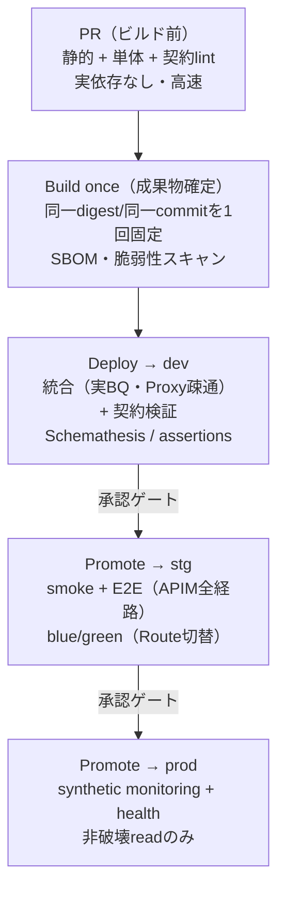
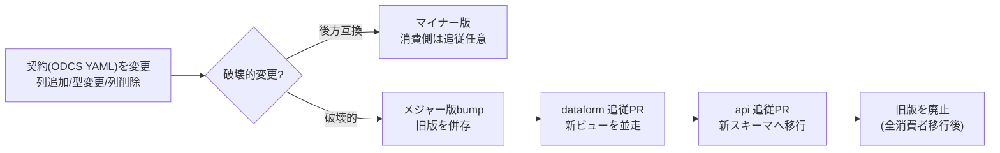

# テスト基本方針（Test Concept）

このプラットフォーム（Dataform → BigQuery、FastAPI → ARO〔Azure Red Hat OpenShift〕上のコンテナ、埋め込み PEP/PDP）を、どういう考え方でテストするかをまとめた**テスト戦略の正本**。実装コードは別リポジトリ（`dataform` / `api`）にあるが、「何を・どの層で・どの段でテストするか」の設計はここを基準にする。

認可関連の略語（PEP/PDP/RLS/CLS/AST/ABAC など）は [`../03-authorization/glossary.md`](../03-authorization/glossary.md) を参照。テスト固有の用語は本書内で都度説明する。

---

## 1. 基本の考え方（7 原則）

テストの細部に迷ったら、まずこの原則に立ち返る。

| # | 原則 | なぜ |
|---|---|---|
| 1 | **形はピラミッドの土台を残した「統合厚め＋契約レイヤ独立」** | 本基盤の複雑さはロジック単体より「境界」（BigQuery・認可・スキーマ契約・クラウド連携）にある。単一サービスだが境界が多いので、統合とコントラクトに重心を置く（後述）。 |
| 2 | **build-once / promote と揃える** | 「コードを直す系のテスト（単体・静的・契約・mock）はビルド前に 1 回」「環境が動くか系（実 apply・スモーク・ヘルス・合成監視）は各昇格後」。同一成果物を dev→stg→prod へ動かす原則は [`../02-architecture/repository-strategy.md`](../02-architecture/repository-strategy.md) が正本。 |
| 3 | **shift-left ＋ 本番監視の二段構え** | CI で「契約破壊・退行」を出荷前に止める。本番では「データ drift・SLO 逸脱」を継続監視で捕捉する。役割が違うので両方やる。 |
| 4 | **実データに依存しないテストを土台にする** | stg に本番相当データが少なくても、正しさは「固定入力のユニットテスト＋合成データ」で担保できる。データ量に左右される検証は最小限に寄せる。 |
| 5 | **fail securely と negative testing を最優先（特に認可）** | 「拒否すべきが拒否されるか」「黙って広く見せていないか／列が漏れていないか」が最も危険な退行。allow より deny を厚くテストする。 |
| 6 | **1 エンティティ = テストも 1:1 対応** | `outputs/<entity>.sqlx` ↔ `src/<entity>/` ↔ `policies/<entity>.csv` の同名対応にテストも紐づけ、**新規追加時に必須テストが揃わなければマージ不可**にする（CI ゲート）。 |
| 7 | **fix-forward。テストで環境を直さない** | stg で露出した不備は環境を手で直さず、dev で再現するテストを足してコードを直す。退行を二度と素通りさせない。 |

---

## 2. テストの全体像（テストピラミッドをどう実現するか）

### 形の選び方

「ピラミッド（単体多め）」か「トロフィー／ハニカム（統合多め）」かは、システムの複雑さがどこにあるかで決まる、というのが 2026 の共通見解。本基盤は **FastAPI 1 サービス + 外部依存（BigQuery・Open-GIM・APIM）** で、複雑さが境界に集中する。よって純ピラミッドではなく、**土台に単体を残しつつ統合を厚くし、契約テストを独立レイヤとして足す**形にする。認可は分岐が多いので単体も薄くしない。

### レイヤと配置（共通ビュー）

| レイヤ | 何を検証 | 主なツール | 外部依存 | 走らせる段 |
|---|---|---|---|---|
| **静的（土台）** | 整形・型・lint・スキーマ記述品質・脆弱性・ポリシー as code | ruff / mypy・pyright / Spectral / Trivy・Snyk / tflint・Checkov | なし | PR |
| **単体** | 純ロジック（変換ロジック、AST→SQL 翻訳、認可判定、Pydantic 境界）。外部はフェイク／モック | Dataform `type:"test"` / pytest / Hypothesis / `terraform test (plan)` | なし | PR |
| **統合（最厚）** | 境界をまたいだ実挙動（実 BigQuery、Proxy 疎通、行フィルタ／列マスクが実 SQL として効くか） | pytest + 実 BQ テスト用データセット / Dataform assertions / `terraform test (apply)`・Terratest | 実依存（dev） | merge 後 dev |
| **契約** | 提供 API ↔ 消費 BU、Dataform 出力 ↔ API 参照のスキーマ整合 | Schemathesis / Pact / data contract 突合 | スキーマ／dev API | PR（lint）＋ dev（検証） |
| **E2E・スモーク** | APIM→ARO→BigQuery の全経路、認可の代表シナリオ | pytest / API 呼び出し | stg | stg 昇格後 |
| **合成監視・ヘルス** | 本番での非破壊な疎通・SLO 監視 | App Insights Standard availability test / OpenTelemetry | prod | prod 常時 |

> 比率の目安（テスト本数でなく投資配分の感覚）: 静的＝常時 / 単体 20–25% / 統合 40–45% / 契約 20% / E2E 10% / 合成 5%。

### どの段で何を走らせるか（パイプライン全体）

「コードを直す系」は PR で 1 回、「環境が動くか系」は各昇格後、という分担が build-once / promote の肝。具体配置はこの後の各セクションと「CI/CD パイプラインでのテスト配置」にまとめる。

---

## 3. Dataform（データ基盤）のテスト

### 基本の仕組み

Dataform は 4 つの手段を段階的に使う。

1. **`dataform compile`（静的検証）** — DAG・参照・型の整合をデプロイ前に確認。
2. **`dataform test`（ユニットテスト）** — `config { type: "test" }` で**入力を固定（フェイク入力に動的差し替え）**し、変換クエリの出力が期待行と一致するか検証する。**実データに一切依存しない**ので、stg のデータ量と無関係に「変換ロジックの正しさ」を担保できる（原則 4 の中核）。
3. **`dataform run --dry-run`** — BigQuery 側で実行せず SQL を検証（構文・権限）。
4. **assertions（実データ品質）** — `uniqueKey` / `uniqueKeys` / `nonNull` / `rowConditions`、および任意ロジックは「0 行返れば pass」の手書き assertion。**実データに対して**品質を保証する。

> ユニットテスト（`type:"test"`、実データ不要）と assertions（実データの品質チェック）は別物。両方使う。

### 実例

- `outputs/<entity>.sqlx`（公開テーブル）には `uniqueKey`／`nonNull`／`rowConditions` を最低限付与し、API 公開面の前提をデータ側で守る。エンティティ間の参照整合性（FK 相当）は「0 行クエリ」の手書き assertion で。
- `intermediate/` の集計・分岐・日付演算など込み入った変換は `dataform test` でロジック検証を優先する。
- assertion ファイル名は `assert_<table>_<rule>.sqlx`。命名・層構造（sources/intermediate/outputs）の正本は [`../06-data-platform/dataform-naming-convention.md`](../06-data-platform/dataform-naming-convention.md)。

### 補足

- dbt の `unit_tests`（1.8+）は参考事例。本基盤の変換層は Dataform なので、移植せず **Dataform ネイティブの `type:"test"` を採用**する。
- Dataform は既定では「**assertion が失敗しても後続モデルが走る**」。Core 3.x の `includeDependentAssertions` / `dependOnDependencyAssertions` で依存を明示し、失敗が下流を止めるようにする。
- `--dry-run` は全構文エラーを必ず捕捉するとは限らない。compile＋dry-run は「型・参照・大半の構文」を見るだけで、ロジック正しさは `type:"test"`／assertion で別途担保する。

### 展開イメージ（どの段で）

- **PR**: `compile` ＋ `test`（ユニット）＋ `run --dry-run` ＋ 契約突合（次節）。実データ不要のゲート。
- **dev run 後**: 実データに対し assertions。
- **stg/prod**: 同一 commit を昇格し、実データへの assertions ＋ freshness／volume／schema drift の継続監視（Soda 等）。

---

## 4. api（FastAPI）のテスト

### 基本の仕組み

- **`TestClient`（同期）／`httpx.AsyncClient`（async）** でハンドラを呼ぶ（FastAPI 公式）。async は `pytest-anyio` に統一し、`pytest-asyncio` と混在させない。
- **`app.dependency_overrides`** で外部依存を差し替える。**`repository`（BigQuery 参照）と `authorize`（認可）を `Depends` 注入にしておく**ことが、全レイヤのテスト容易性の土台。テストでは Fake repository や固定 `Decision` に差し替える。

### レイヤ構成

| レイヤ | 対象 | ツール | 依存 |
|---|---|---|---|
| 静的 | 型・lint・OpenAPI 記述品質・脆弱性 | ruff / mypy・pyright / Spectral / Trivy・Snyk | なし |
| 単体 | AST→SQL 翻訳、Pydantic 境界、認可判定。認可の不変条件はプロパティテスト | pytest / Hypothesis | なし（Fake/Stub） |
| 統合（最厚） | ハンドラ〜repository を通し、実 BigQuery（テスト用データセット）で行フィルタ／列マスクが実 SQL として効くか。**Proxy 経由疎通の実機検証**を兼ねる | pytest + 実 BQ | 実 BQ（dev） |
| 契約 | スキーマ適合・消費者契約（次節と認可で詳述） | Schemathesis / Pact | dev API |
| E2E・合成 | APIM 全経路・本番監視 | API 呼び出し / App Insights | stg / prod |

### 補足

- **BigQuery のローカルエミュレータ**（`goccy/bigquery-emulator` 等）は beta で、ZetaSQL の一部関数・MV・権限が不完全。**ネット遮断のローカル/PR 高速チェックの補助**に留め、行フィルタ／列マスク／MV と Proxy 疎通の**最終的な正しさは実 BigQuery の統合テストで**確かめる（リポジトリの最優先論点「Proxy 経由の BQ 疎通」と一致）。BigQuery RLS は使わない設計なので、エミュレータの行アクセスポリシー未対応は痛手にならない。
- **OpenAPI の二重スキーマ**: FastAPI は 3.1 を出力し、APIM 取り込み用に 3.0 へダウングレードする。実装適合（Schemathesis）は 3.1 に当て、ダウングレード後の 3.0 は Spectral で lint し「ダウングレードで契約が崩れていないか」を回帰検証する。
- テストダブルの語彙（Dummy/Fake/Stub/Spy/Mock）は Fowler の整理に従う。実物が使いにくい所だけダブルにする（classical 寄り）。

---

## 5. スキーマ契約（dataform ↔ api の drift 対策）

### 基本の仕組み

リポジトリを分けた案 B では、Dataform が作る BigQuery テーブルと FastAPI が読む前提がずれると API が壊れる（schema drift）。これが分割の最重要リスク。対策の正本方針は [`../02-architecture/repository-strategy.md`](../02-architecture/repository-strategy.md) の契約方針に従い、テスト面では次のようにする。

- **data contract（機械可読なテーブル契約：列名・型・PII タグ・制約）を「単一の真実」**にし、producer（Dataform）と consumer（API）の両 CI で突き合わせる。CI が契約のゲートキーパーになる。
- **両方向で検証**: producer 側は「BigQuery 実スキーマ ↔ 契約」、consumer 側は「API レスポンスモデル ↔ 契約」。
- **破壊的変更（列削除・既存列の型変更・制約変更）は CI で検知し、メジャー版 bump を強制 ＋ 旧版併存で段階適用**。

### 契約変更のフロー

### 補足

- 契約フォーマットは **Open Data Contract Standard (ODCS) v3.1.0** を第一候補に。従来広く使われた datacontract.com 仕様（Data Contract Specification）は **v1.2.1 で非推奨化が告知され 2026 年末でサポート終了**、ODCS への移行が推奨されているため。
- dbt の model contracts（`contract: {enforced: true}` のプリフライト検査）は、列名・型の厳密一致を build 時に強制する参考実装。Dataform でも「契約 ↔ 実スキーマ」を CI で同等に突き合わせる。
- 専用リポ `data-contracts` を採用するか、契約検証を dataform/api の CI に内製するかは未決（[`../02-architecture/repository-strategy.md`](../02-architecture/repository-strategy.md) のオープン事項）。

---

## 6. PDP/PEP（認可）のテスト

認可は **2 段に分ける**（①粗い gate の allow/deny → ②行フィルタ `row_filter(AST)` と列マスク `masked_columns` の生成）。テストもこの 2 段に沿って分ける。`authorize()` インターフェースと 2 段認可の正本は [`../03-authorization/authorization-boundaries-and-interface.md`](../03-authorization/authorization-boundaries-and-interface.md)。PyCasbin の実装メモは [`../03-authorization/pycasbin/`](../03-authorization/pycasbin/) を参照。

### 基本の仕組み（テストのレイヤ）

| レイヤ | 対象 | 何を検証 |
|---|---|---|
| **L1 PDP 単体** | `model.conf` ＋ `<entity>.csv` をロードした Enforcer | `enforce`／`enforce_ex` の effect と**マッチしたポリシー行（reason）**。allow/deny 両方、**negative 中心**。属性はフェイクオブジェクト |
| **L2 Decision 単体** | `authorize() -> Decision` | effect／reason／**`row_filter`(AST) の golden**／**`masked_columns` 集合**／obligations。**fail securely**（属性欠落・PIP 障害時に deny） |
| **L3 翻訳層単体** | AST → パラメータ化 WHERE | 決定性・プレースホルダ化・**インジェクション耐性**。プロパティテスト |
| **L4 属性組合せ** | L1/L2 を直積で | 居住国 × 部門 × 役職の**代表値**直積（境界値）。組合せ爆発はグループ代表で抑制 |
| **L5 結合（PEP↔PDP↔DB）** | FastAPI 経路 ＋ サンプル/実 BQ | **list で絞れる** & **detail 単件で `enforce()` が効く**（BOLA）。**masked 列が結果に出ない**（BOPLA）。**2 アカウント**で他者データに到達不可 |
| **L6 セキュリティ回帰** | golden / shadow / dry-run | 既存判定スナップショット不変。fail-secure。TOCTOU（キャッシュ失効後に古い allow を返さないか） |

### 実例・要点

- **enforce_ex でマッチ行まで固定**すると、「同じ allow でも別ルートで通った」退行を検知できる。reason を golden に含める。
- **「黙って絞る」ロジックは戻り値を直接アサート**する層（L2）を必ず持つ。`row_filter` の AST を golden 化し、`masked_columns` は順序非依存の集合比較。
- **BOLA / BOPLA は OWASP API Security Top 10 2023 の直撃領域**。詳細画面で 1 件開いたときの最終 `enforce()` チェック（[`../03-authorization/pycasbin/single-record-final-check.md`](../03-authorization/pycasbin/single-record-final-check.md)）は L5 で必須。「list には出ないが単件取得で漏れる」典型穴を、list と detail の両経路でテストする。
- 属性（Open-GIM＝PIP）は `AttributeProvider` 相当のインターフェースで抽象化し、テストは固定辞書のフェイクを注入してネットワークなしで回す。Open-GIM 実体疎通は別レイヤに隔離（突合キー・到達経路は未決のためモック前提で先行設計できる）。

### 補足

- PyCasbin の ABAC は属性を `r.sub`／`r.obj` オブジェクトに載せて enforce へ渡す（ポリシー側 `p.*` には属性を載せられない制約）。テストでも「Open-GIM から取得済みの属性オブジェクト」を組み立てて渡す。
- PyCasbin に専用のテストフィクスチャ機構はない。Cerbos の `*_test.yaml`（principals/resources/expected）形式を**自前 YAML として採用**し pytest で読み込むと、エンジン非依存の golden が作れる（将来 Cerbos/OPA へ差し替える際に資産を流用しやすい）。Decision を **AuthZEN 1.0** の形（subject/action/resource/context → 判定＋obligations）に寄せておくと、差し替えの保険になる。
- 参考手法: OPA（`opa test`、`with` でのモック、>90% カバレッジ）、Cerbos（compile 失敗で CI 停止）、Cedar（差分／プロパティベーステスト）。「明示しない組合せは deny を期待」をテストの既定にする。

### 新規追加時 / 変更時に必須化すること

- **新規エンティティ追加**: L1 の行カバレッジ（新 CSV の全行が最低 1 テストで効く）＋ L2 の Decision golden ＋ L5 の list／detail BOLA テストが揃わなければマージ不可。
- **ポリシー変更**: CI が「この PR でどの subject×resource の判定が変わるか」の golden 差分を自動生成 → **CODEOWNERS（セキュリティ担当）レビュー必須** ＋ 変更行の新テスト ＋ カバレッジ非低下。本番投入前に **shadow / dry-run**（新旧ポリシーで評価しログ比較）を 1 ステージ挟む。

---

## 7. Terraform / IaC のテスト

> IaC 方針（Bicep か Terraform か）は社内確認中。後戻りコストが高いので最初に確定する論点（[`../05-planning/implementation-roadmap.md`](../05-planning/implementation-roadmap.md)）。本節は Terraform 前提で記す。

### 基本の仕組み（IaC のピラミッド）

1. **静的解析** — `terraform fmt` / `terraform validate` / `tflint`（プロバイダ固有ミス・非推奨構文）。クラウド API を叩かないので最速。pre-commit と CI 両方に。
2. **ポリシー as code** — **Checkov**（最広）／**Trivy**（旧 tfsec）／**OPA conftest**（plan JSON を Rego で評価）。社内制約（実行基盤は承認済みの ARO に限定〔旧「コンテナ不可」制約は撤廃〕、Azure 永続ストアは Azure SQL のみ、外部通信は Proxy 経由のみ等）を plan JSON のゲートとして機械的に止める。
3. **ユニット（`terraform test`、`command = plan`）** — リソースを作らず構成ロジック・変数補間・条件を検証。**mock providers（1.7+）で認証情報なしに plan テスト**が書ける。
4. **統合（`terraform test`、`command = apply` ／ Terratest）** — ephemeral（使い捨て）環境に実 apply → assert → 自動 destroy。実 API 挙動の検証が要るときは Terratest（Go）。

### 補足

- `terraform test`（`.tftest.hcl`、`run`／`assert`／`expect_failures`）は **Terraform 1.6 で GA、mock providers は 1.7 で追加**。「構成値の検証中心なら native、外部挙動なら Terratest」が住み分け。
- **plan ユニットは全 PR の必須ゲート**、**実 apply 統合はコスト理由で promote 前 or nightly** に限定し dev 相当の ephemeral 環境で回す。
- エンティティ単位ディレクトリ構成なので、paths フィルタで**変更モジュールだけ**テストするとコストを抑えられる。
- Sentinel は Terraform Cloud/Enterprise 前提でロックインに注意。本基盤は OPA conftest / Checkov を優先。

---

## 8. CLI のテスト

### `@dataform/cli`

- CI は **`compile`（静的検証）→ `test`（ユニット、フェイク入力で SELECT 等価）→ `run --dry-run`（BigQuery 実クエリ検証）** の 3 段が素直。`run`（実体化）は promote 後に環境別 `--default-database` 等の注入で。
- 環境差は `--vars` / `--default-database` / `--schema-suffix` / `--tags` で注入する（環境をフォルダやブランチで分けない。注入方式の正本は [`../06-data-platform/migration-plan.md`](../06-data-platform/migration-plan.md)）。
- 注意: アクション数が非常に多いと `--dry-run` が socket hang up で失敗する既知の報告がある。

### 一般 CLI ツール

- exit code 検証、`--dry-run`／`--check` のドライ実行、スナップショット比較、lint、`--version`／`--help` のスモークが基本パターン。

### GitHub Actions のジョブ設計

- **paths フィルタ（`dorny/paths-filter` 等）で変更検出 → matrix で変更エンティティだけ並列**（`fail-fast: false`）。共通ロジックは reusable workflow に集約し、各エンティティは薄い呼び出しに。1 エンティティ = 1:1 対応を活かす。
- 目安: サービス/エンティティ 5 未満なら個別ファイル、5 以上なら単一オーケストレーション＋動的 matrix。PR は変更分だけ、全量は nightly。

---

## 9. スパースな staging データへの対応

「stg に本番相当データが少ない」問題は、**正しさを実データから切り離す**ことで大半が解ける。

- **合成データをデフォルトにする**。本番データの非本番利用は明示的な業務正当化を要し、出すなら**境界を出る前に PII をマスク**する。生成スクリプト・マスクルールはコードと同一リポでバージョン管理。
- 三層で使い分ける:
  - **合成データ** → 単体・API テスト（Dataform の `type:"test"` 固定入力がここ）。
  - **マスク済み本番サブセット**（参照整合性を保持）→ 統合・E2E。
  - **実行ごとの専用ロード** → テスト分離。
- BigQuery では Gretel／BigQuery DataFrames + LLM でネイティブに合成可能（元データは GCP プロジェクト内に留まり、外部通信 Proxy 制約とも両立）。小さな静的ルックアップは seed（CSV）で投入。
- **正しさはユニット（実データ不要）で PR/dev に前倒し**し、stg では「少量の本番相当サンプル＋合成」で freshness／volume／schema の挙動を確認する。
- fix-forward: stg でしか出なかったエッジケースは、dev で再現できるテストデータ／assertion を足し、dev の表現力を stg に追いつかせる（[`../02-architecture/repository-strategy.md`](../02-architecture/repository-strategy.md) の「stg で不備に気付いた場合」と整合）。

---

## 10. CI/CD パイプラインでのテスト配置（build-once / promote）

「コードを直す系はビルド前に 1 回／環境が動くか系は各昇格後」という原則を、リポジトリ横断で配置する素案。昇格・承認ゲート・OIDC の正本は [`../02-architecture/repository-strategy.md`](../02-architecture/repository-strategy.md)。

| 段 | トリガ | dataform | api（FastAPI） | Terraform | ゲート・認証 |
|---|---|---|---|---|---|
| **PR** | PR push（paths で変更分のみ matrix） | `compile` ＋ `test`（ユニット）＋ 契約突合 | ruff・型 ＋ `pytest -m "unit or contract"` ＋ Spectral（3.1/3.0 両方）＋ Trivy・Snyk | `fmt`・`validate`・`tflint` ＋ Checkov・OPA ＋ `terraform test (plan, mock)` | main 保護・squash・必須レビュー（実依存なし） |
| **Build once** | main マージ | コンパイル成果物を固定 | **コンテナ digest を 1 回ビルド**しレジストリへ。SBOM・脆弱性スキャン | 環境非依存の最終 plan を成果物化 | OIDC（registry push のみの最小権限） |
| **Deploy → dev** | 自動 | `run --dry-run` → `run --default-database=dev` | 同一 digest を dev へ → `pytest -m integration`（実 BQ・**Proxy 疎通の実機検証**）＋ Schemathesis（dev URL, read-only）＋ Pact provider 検証 | 同一 plan を dev に `apply` ＋ ephemeral で実リソース疎通 | OIDC（GitHub→GCP=WIF / GitHub→Azure=federated、dev 限定 `sub`・最小権限） |
| **Promote → stg** | **承認ゲート** | 同一 commit を `--default-database=stg` で `run` ＋ 実データ assertions | **同一 digest を stg ARO へ blue/green（Route 切替）でデプロイ → 切替前にスモーク（APIM 全経路・認可境界）→ Route 切替で本稼働** | 同一 commit/plan を stg に `apply` | GitHub Environments(stg): required reviewers ＋ deployment branches=main |
| **Promote → prod** | **承認ゲート（＋ wait timer 任意）** | 同一 commit を `--default-database=prod` で `run` | 同一 digest を prod ARO へ blue/green（Route 切替）→ 切替前スモーク → Route 切替（失敗時は**Route を旧版へ戻して即ロールバック**） | 同一 commit/plan を prod に `apply` | GitHub Environments(prod): required reviewers（起票者除外）＋ branch 制限 |
| **デプロイ後（常時）** | 各昇格後・定期 | freshness／volume／schema drift 監視（Soda 等） | **synthetic monitoring（主要 5–10 トランザクション）＋ health check** | drift 検知（plan diff 定期チェック） | — |

補足:
- **ARO の readiness / liveness probe**は、PEP/PDP・BigQuery クライアント（Proxy 経由）・Open-GIM 到達など critical 依存を実際に確認する内容にすると、最優先論点の疎通検証を兼ねられる。
- **prod の合成監視**は、Azure の **URL ping test が 2026/09/30 廃止**・multi-step web test 非推奨のため、最初から **Standard availability test（または Playwright ベースの `TrackAvailability`）** で組む。書き込み系の偽トランザクションは行わない（非破壊 read のみ）。
- 統合テスト用のクラウド権限は本番デプロイ用と別の最小権限を切り、OIDC の `sub` を該当 environment（例 `dev`）に固定する。

---

## 11. 新規追加時 / 変更時に必須化すること（CI ゲート要約）

変更の種類ごとに「マージブロックにする必須テスト」を定める。これが原則 6・7 の実体。

| 変更の種類 | 必須化（揃わなければマージ不可） |
|---|---|
| **新規エンティティ追加** | Dataform: `outputs/<entity>.sqlx` に assertions ＋ 変換の `type:"test"`／API: `src/<entity>/` の単体＋統合／認可: `<entity>.csv` の行カバレッジ＋Decision golden＋list/detail の BOLA テスト／契約: 新エンティティの contract と両側突合 |
| **ポリシー（認可）変更** | golden 差分の自動生成 → CODEOWNERS（セキュリティ）レビュー ＋ 変更行の新テスト ＋ カバレッジ非低下 ＋ 本番前 shadow/dry-run |
| **スキーマ（契約）変更** | producer/consumer 両側の契約突合。破壊的変更ならメジャー版 bump ＋ 旧版併存で段階適用 |
| **変換ロジック変更** | 該当 `type:"test"` の更新／追加 ＋ 関連 assertions |
| **IaC 変更** | 静的解析 ＋ ポリシー as code ＋ `terraform test (plan)`。本番影響大なら ephemeral での実 apply 統合 |

---

## 12. 未決事項 / 次アクション

- [ ] IaC 方針（Bicep か Terraform か）の確定（社内方針確認）。確定後に本書の Terraform 節を更新。
- [ ] `data-contracts` 専用リポを採用するか、契約検証を dataform/api の CI に内製するかの決定（[`../02-architecture/repository-strategy.md`](../02-architecture/repository-strategy.md) のオープン事項）。契約フォーマットは ODCS v3.1.0 を候補に。
- [ ] BigQuery 統合テストの実機方式（Proxy 経由疎通）の確立。PoC 最優先論点（[`../05-planning/implementation-roadmap.md`](../05-planning/implementation-roadmap.md)）と一体で進める。
- [ ] BigQuery エミュレータの採否（ローカル/PR 補助に限定する前提での評価）。
- [ ] 消費者契約を Pact OSS（CDC）で回すか、将来 PactFlow の Bi-Directional（商用）に寄せるかの方針。
- [ ] 本番データ品質監視ツール（Soda 等）の選定と監視項目（freshness／volume／schema）の定義。
- [ ] AST→BigQuery SQL 翻訳層の設計（[`../03-authorization/authorization-boundaries-and-interface.md`](../03-authorization/authorization-boundaries-and-interface.md) の未決と連動）。翻訳層の単体テスト（L3）はこの設計に依存。
- [ ] 各リポの CI 雛形（PR ゲート／build-once／promote）にテストジョブを組み込む。

---

## 公式リファレンス（一次情報）

### テスト戦略・テストピラミッド論
- Martin Fowler "The Practical Test Pyramid" — https://martinfowler.com/articles/practical-test-pyramid.html
- Martin Fowler "TestDouble" / "Mocks Aren't Stubs" — https://martinfowler.com/bliki/TestDouble.html / https://martinfowler.com/articles/mocksArentStubs.html
- Martin Fowler "Microservice Testing" — https://martinfowler.com/articles/microservice-testing/
- Kent C. Dodds "Write tests. Not too many. Mostly integration." / "Testing Trophy" — https://kentcdodds.com/blog/write-tests / https://kentcdodds.com/blog/the-testing-trophy-and-testing-classifications
- Spotify Engineering "Testing of Microservices"（Honeycomb）— https://engineering.atspotify.com/2018/01/testing-of-microservices
- web.dev "Pyramid or Crab?" — https://web.dev/articles/ta-strategies

### Dataform・データ品質・契約
- Dataform assertions — https://docs.cloud.google.com/dataform/docs/assertions
- Dataform CLI リファレンス（`compile`/`test`/`run`/`--dry-run`）— https://docs.cloud.google.com/dataform/docs/reference/dataform-cli-reference
- Dataform CLI の使い方 — https://docs.cloud.google.com/dataform/docs/use-dataform-cli
- Dataform CLI で UDF をユニットテスト（Google Cloud Blog）— https://cloud.google.com/blog/topics/data-warehousing/learn-how-to-use-the-dataform-cli-tool-to-unit-test-udfs
- dbt unit tests（参考）— https://docs.getdbt.com/docs/build/unit-tests
- dbt model contracts（参考）— https://docs.getdbt.com/docs/mesh/govern/model-contracts
- Open Data Contract Standard (ODCS) — https://github.com/bitol-io/open-data-contract-standard
- Data Contract Specification / CLI（2026 末 EOL 告知、ODCS へ移行）— https://datacontract.com/
- BigQuery で合成データ生成（Gretel）— https://cloud.google.com/blog/products/data-analytics/create-synthetic-data-with-gretel-in-bigquery
- BigQuery DataFrames + LLM で合成データ — https://cloud.google.com/blog/products/data-analytics/generate-synthetic-data-with-bigquery-dataframes-and-llms

### FastAPI・API 契約・pytest
- FastAPI Testing / Testing Dependencies / Async Tests — https://fastapi.tiangolo.com/tutorial/testing/ / https://fastapi.tiangolo.com/advanced/testing-dependencies/ / https://fastapi.tiangolo.com/advanced/async-tests/
- Schemathesis — https://schemathesis.io/ / https://github.com/schemathesis/schemathesis
- Pact（Consumer-Driven Contract）— https://docs.pact.io/
- PactFlow Bi-Directional Contract Testing — https://pactflow.io/bi-directional-contract-testing/
- Spectral（OpenAPI lint）— https://stoplight.io/open-source/spectral / https://github.com/stoplightio/spectral
- pytest parametrize / markers — https://docs.pytest.org/en/stable/how-to/parametrize.html / https://docs.pytest.org/en/stable/example/markers.html
- coverage.py（分岐カバレッジ）/ pytest-xdist / Hypothesis — https://coverage.readthedocs.io/ / https://pytest-xdist.readthedocs.io/ / https://hypothesis.readthedocs.io/
- goccy/bigquery-emulator（補助）/ Testcontainers Python — https://github.com/goccy/bigquery-emulator / https://github.com/testcontainers/testcontainers-python

### 認可テスト
- PyCasbin / enforce テスト実例 — https://github.com/casbin/pycasbin / https://github.com/apache/casbin-pycasbin/blob/master/tests/test_enforcer.py
- Casbin ABAC / モデル構文 / API 概要 — https://casbin.apache.org/docs/abac/ / https://casbin.org/docs/syntax-for-models/ / https://www.casbin.org/docs/api-overview
- OPA Policy Testing（`opa test`・`with` モック・カバレッジ）— https://www.openpolicyagent.org/docs/policy-testing
- Cerbos ポリシーのテスト / compile — https://docs.cerbos.dev/cerbos/latest/tutorial/04_testing-policies.html / https://docs.cerbos.dev/cerbos/latest/policies/compile.html
- Cedar の差分／プロパティベーステスト — https://www.amazon.science/blog/how-we-built-cedar-with-automated-reasoning-and-differential-testing
- OWASP WSTG Authorization Testing / IDOR / Privilege Escalation — https://owasp.org/www-project-web-security-testing-guide/latest/4-Web_Application_Security_Testing/05-Authorization_Testing/README
- OWASP API1:2023 BOLA / API3:2023 BOPLA — https://owasp.org/API-Security/editions/2023/en/0xa1-broken-object-level-authorization/ / https://owasp.org/API-Security/editions/2023/en/0xa3-broken-object-property-level-authorization/
- OWASP ASVS — https://owasp.org/www-project-application-security-verification-standard/
- OpenID AuthZEN（Authorization API 1.0）— https://openid.github.io/authzen/

### Terraform・IaC・CI/CD・Azure
- Terraform Tests（言語リファレンス）/ Provider Mocking / チュートリアル — https://developer.hashicorp.com/terraform/language/tests / https://developer.hashicorp.com/terraform/language/tests/mocking / https://developer.hashicorp.com/terraform/tutorials/configuration-language/test
- Terratest — https://terratest.gruntwork.io/
- GitHub OIDC（keyless）— https://docs.github.com/en/actions/concepts/security/openid-connect
- GCP keyless authentication from GitHub Actions — https://cloud.google.com/blog/products/identity-security/enabling-keyless-authentication-from-github-actions
- DORA Deployment automation / Capabilities — https://dora.dev/capabilities/deployment-automation/ / https://dora.dev/capabilities/
- Azure Red Hat OpenShift / OpenShift Deployments（rolling・blue-green・canary）/ アプリのヘルス（probe）— https://learn.microsoft.com/en-us/azure/openshift/ / https://docs.openshift.com/container-platform/latest/applications/deployments/deployment-strategies.html / https://docs.openshift.com/container-platform/latest/applications/application-health.html
- Azure Monitor Application Insights availability（Standard test）— https://learn.microsoft.com/en-us/azure/azure-monitor/app/availability
- GitHub Environments 保護ルール / デプロイ承認 — https://docs.github.com/en/actions/reference/workflows-and-actions/deployments-and-environments
